# 第一章-硬件

## 1.1-元件选型

## 1.2-原理图与PCB

底板原理图

各个模块的供电电压?

模块接口引脚顺序？

如何确定使用单片机那个引脚？


STM32F103C8T6核心板原理图(可能使用不同核心板略有差异)


PCB顶层截图

不同类型线粗细

布局总线方式


## 1.3-焊接

PCB正面


PCB背面


然后插上元件


## 1.4-结构与组装

这是组装好的车体照片


然后小车安装PCB

注意电机和红外对管不要插错


## 1.5-测试

使用万用表 上电前测试一下

# 第二章-GPIO与中断

## 2.0-新建工程


建议选择和我一样的版本


新建一个工程

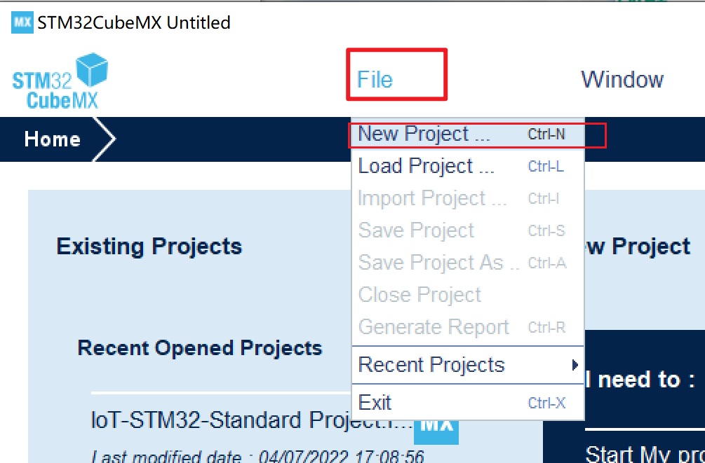

选择芯片

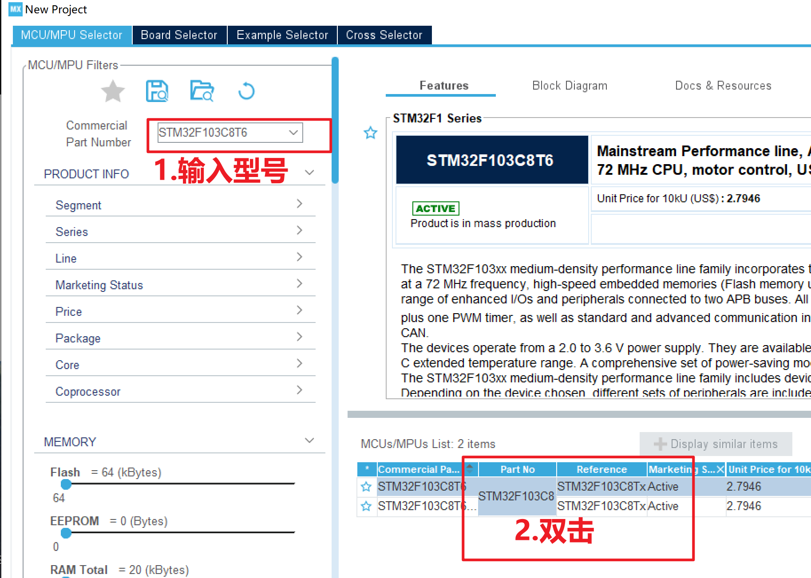

选择时钟源


配置时钟树


选择调试


勾选生成独立的文件


设置保存地址


勾选这个不添加没有使用库文件可以减小工程文件大小(也可以不勾选，保持默认设置)


MDK打开工程，调低优化等级


以上是每次新建工程要做的

以后我们不在新建工程，使用之间的工程即可

## 2.1-点灯

这里我们点亮PC13连接的小灯


配置PC13


生成代码


生成代码后，使用MDK打开工程


先编译一下，没有报错、没有问题


在BEGIN和END添加代码


```C
	HAL_GPIO_TogglePin(LED_GPIO_Port,LED_Pin);
	HAL_Delay(500);
```

根据自己的芯片选择


### 烧录程序(必看 使用其中一个方法)


#### 方法一：使用DAP LINK

**接线图**


DAP 在Win 10 免驱动的

然后根据自己使用的工具在MDK中设置下载工具


设置下载算法


然后下载程序，复位小灯闪烁


烧录后现象

小灯每0.5秒闪烁一次

#### 方法二：使用stlink

**接线图**

STlink不要接3.3V 


使用Stlink 前先安装驱动


双击运行


选择ST-Link


选择算法


然后点击编译，烧录


烧录后现象

小灯每0.5秒闪烁一次

### 补充可能遇到的失败情况

#### 使用DAP-LINK

如果我们芯片IDCODE是0x2 开头的那么我们需要替换一下Keil 的器件包

(如果你是0x1 开头的，如果能下载可以不替换)


STM32小车相关资料V3.3.0\04使用的软件\中科芯CKS芯片支持包


下面这个算法就会自动切换


#### 使用stlink

## 2.2-按键

先看原理图

PB4--KEY1      单片机设置下拉输入-、上降沿触发

PA12--KEY2    单片机设置上拉输入、下降沿触发

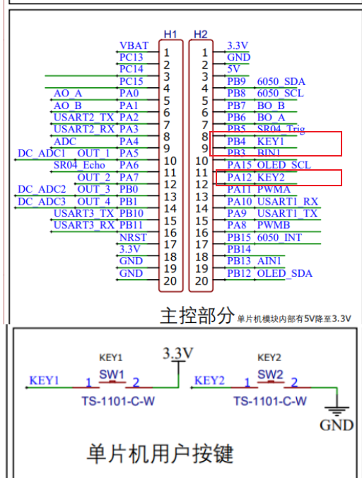

开始配置


使能外部中断


然后生成代码

重新实现中断回调函数、编写按键检测程序


在gpio.c 中我们编写该函数


```c
void HAL_GPIO_EXTI_Callback(uint16_t GPIO_Pin)
{
	if(GPIO_Pin == KEY1_Pin){//判断一下那个引脚触发中断
	//这里编写触发中断后要执行的程序
	HAL_GPIO_TogglePin(LED_GPIO_Port,LED_Pin);//切换LED GPIO状态
	}
	if(GPIO_Pin == KEY2_Pin){//判断一下那个引脚触发中断
	//这里编写触发中断后要执行的程序
	HAL_GPIO_TogglePin(LED_GPIO_Port,LED_Pin);//切换LED GPIO状态
	}
}
```

把main中控制闪烁注释掉


烧录后的现象

按下KEY1 或者KEY2可以切换LED灯开关状态

# 第三章-OLED使用

## 3.1-资料准备

我们先去下载这个OLED模块的资料

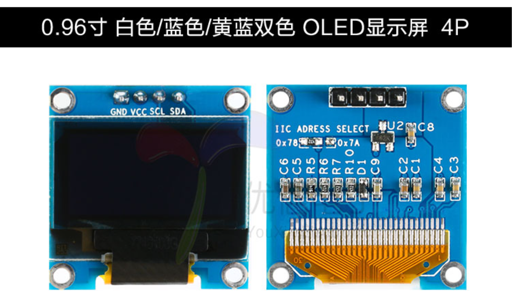

这里我们下载:**优信电子--0.96寸 OLED显示液晶屏模块 IIC液晶屏  四引脚**

淘宝链接:

https://item.taobao.com/item.htm?spm=a230r.1.14.16.504611e6WA3Clv&id=562145367495&ns=1&abbucket=3#detail

OLED资料链接:

**0.96寸（4管脚）资料下载链接：**

https://pan.baidu.com/s/1J57Izsv-PKmbwVrA2ynDzg            提取码：vktz

找到我们要的历程--中景园电子0.96OLED显示屏_STM32F103C8_IIC_V1.0


## 3.2-相关知识

这个OLED是IIC协议，很多都是单片机模拟IIC和模块通信的，这个也是模拟IIC控制OLED的

我们先看一下这个历程


所谓我们移植的时候替换相关初始化内容和GPIO置为函数就行

## 3.3-解决一些错误

把OLED文件复制过去


添加组和包含文件

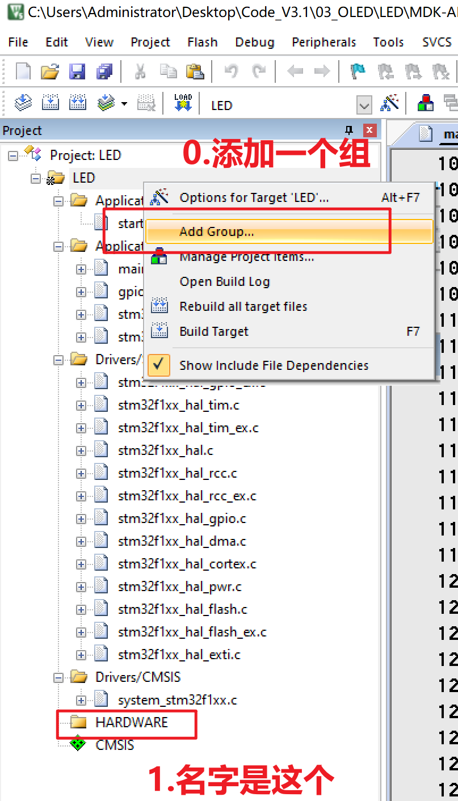

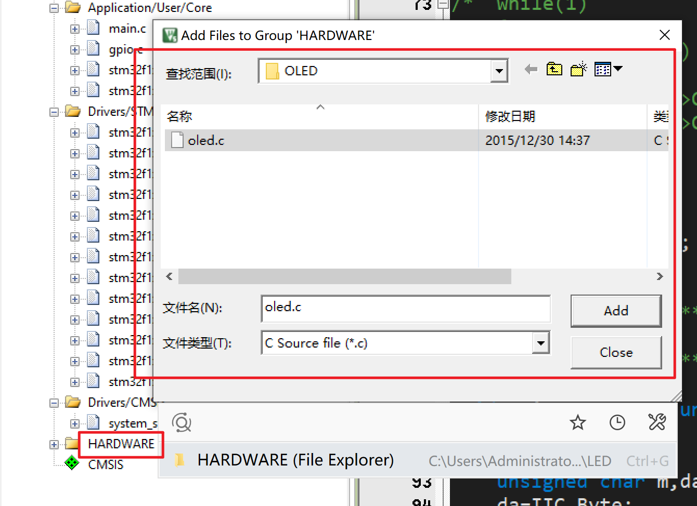

选择添加路径

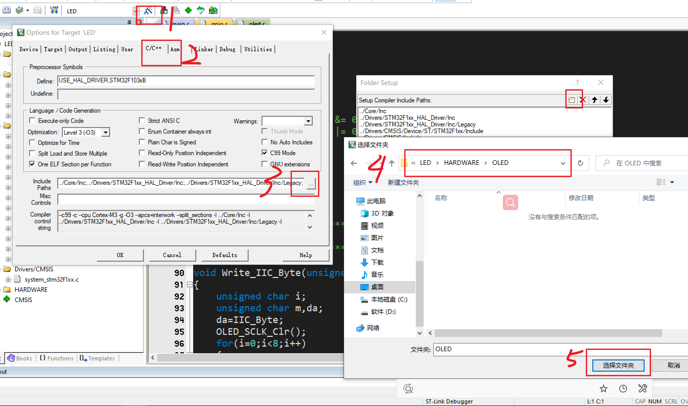

编译一下--找不到sys.h 删掉sys.h 

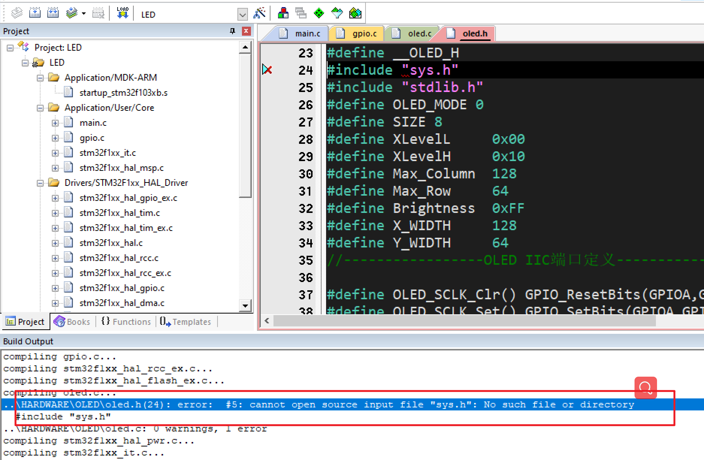

编译一下--把所有的u8都替换成uint8_t u32 替换成uint32_t


编译报错 找不到uint8_t  包含一下#include "main.h"	  解决


有警告 声明加上void

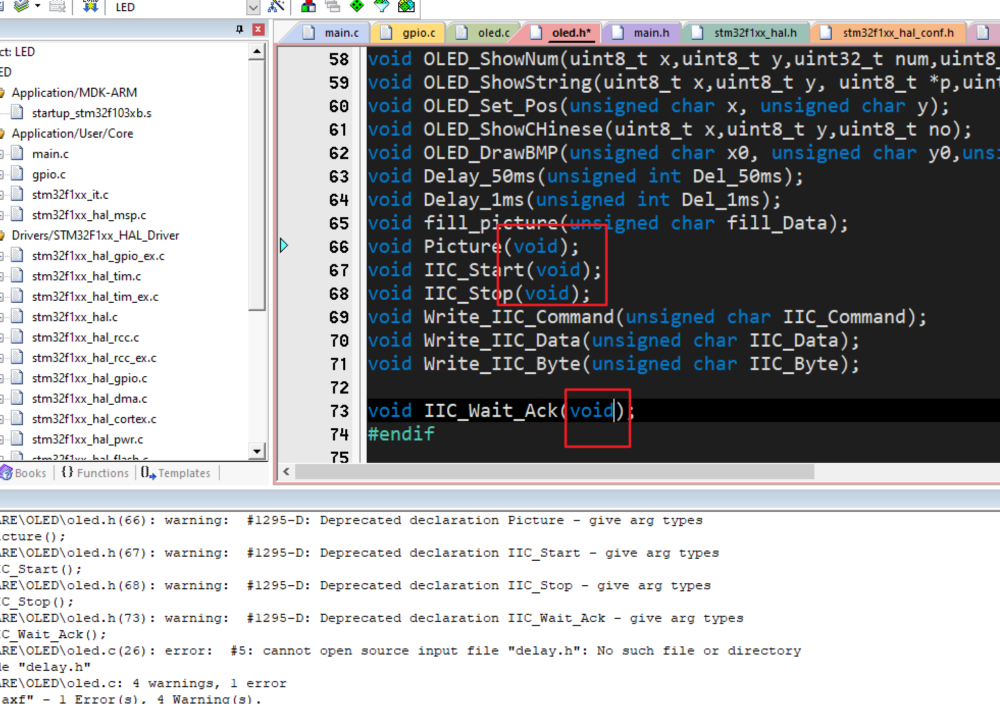


下面是一些GPIO的错误，我要解决初始化问题了


## 3.4-开始初始化OLED

先看原理图  **SDA-PB12  SCL-PA15**

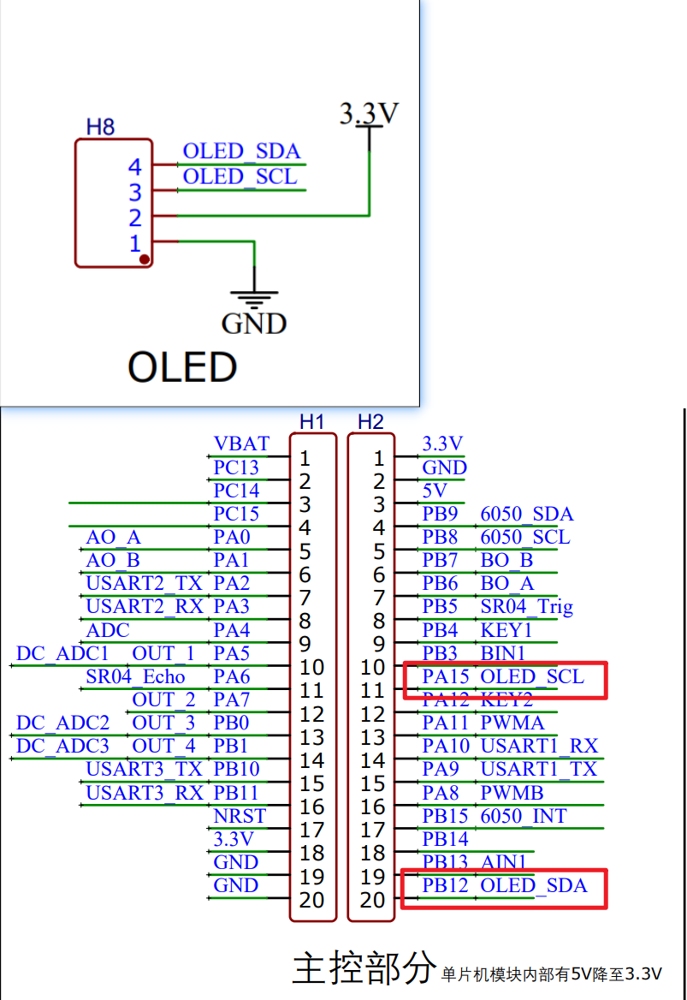

然后我们开始初始两个GPIO为输出模式--上拉输出模式


然后我们生成代码，更改一下IIC协议的GPIO设置，和初始化部分


```c
#define OLED_SCLK_Clr() HAL_GPIO_WritePin(OLED_SCL_GPIO_Port, OLED_SCL_Pin, GPIO_PIN_RESET)//设置SCL低电平
#define OLED_SCLK_Set() HAL_GPIO_WritePin(OLED_SCL_GPIO_Port, OLED_SCL_Pin, GPIO_PIN_SET)//设置SCL高电平

#define OLED_SDIN_Clr() HAL_GPIO_WritePin(OLED_SDA_GPIO_Port,OLED_SDA_Pin,GPIO_PIN_RESET)//设置SDA低电平
#define OLED_SDIN_Set() HAL_GPIO_WritePin(OLED_SDA_GPIO_Port,OLED_SDA_Pin,GPIO_PIN_SET)//设置SDA高电平
```


下面delay函数出现报错 我们替换成HAL_Delay


编译没有报错了，我们在主函数添加初始化和测试代码


```c
  OLED_Init();			//初始化OLED  
  OLED_Clear(); 
  
  		OLED_ShowCHinese(0,0,0);//中
		OLED_ShowCHinese(18,0,1);//景
		OLED_ShowCHinese(36,0,2);//园
		OLED_ShowCHinese(54,0,3);//电
		OLED_ShowCHinese(72,0,4);//子
		OLED_ShowCHinese(90,0,5);//科
		OLED_ShowCHinese(108,0,6);//技
  
```

烧录下载 现象OLED屏幕显示-中景园电子科技

# 第四章-串口实验(简单输出)

这里我们先初始化串口一、实现数据输出。

## 4.1-串口编写

软件初始化


然后我们实现串口数据输出

方法一：


```C
	uint8_t c_Data[] = "串口输出测试:好家伙VCC\r\n";
	HAL_UART_Transmit(&huart1,c_Data,sizeof(c_Data),0xFFFF);
	HAL_Delay(1000);
```

方法二:实现printf函数

打开微库


重定向fputc


```C
/**
* @brief 重定向printf (重定向fputc)，
					使用时候记得勾选上魔法棒->Target->UseMicro LIB 
					可能需要在C文件加typedef struct __FILE FILE;
					包含这个文件#include "stdio.h"
* @param 
* @return 
*/
int fputc(int ch,FILE *stream)
{
	HAL_UART_Transmit(&huart1,( uint8_t *)&ch,1,0xFFFF);
	return ch;
}
```

如果有错误


在usart.c添加这个typedef struct __FILE FILE;


添加一下测试(记得包含"stdio.h")


```c
printf("printf:好家伙VCC测试\r\n");
```

## 4.2-串口实验

### 接线图

先烧录好，再连接串口查看现象

连接串口 可以使用  USB转TTL如CH340模块 或者 用DAP的串口功能

**使用USB转TTL如CH340模块**


**使用DAP**


然后我们打开串口助手，选择串口端口和波特率，就可以看到输出


蓝牙模块使用 

蓝牙模式使用在后面章节讲解

# 第五章-PWM控制电机

## 5.1-认识PWM 

参数如何描述PWM

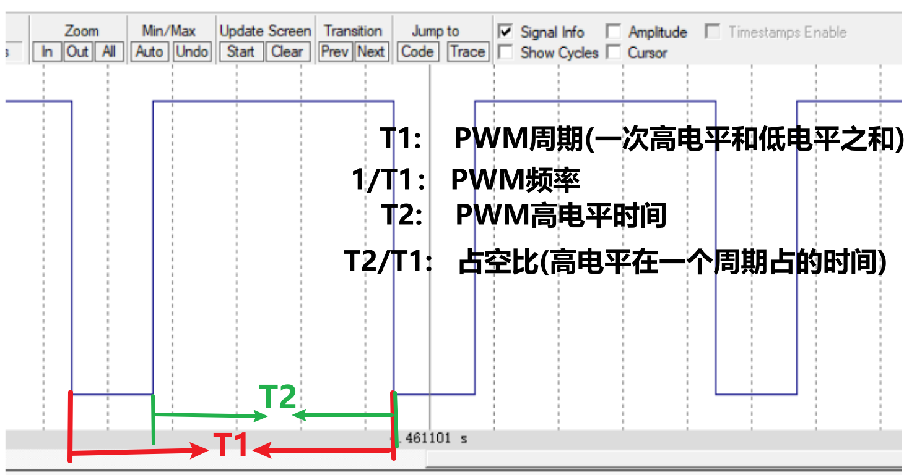

## 5.2-PWM配置

根据我们小车原理图我们知道是 **PA11和PA8**两个引脚要设置为PWM输出

这里为什么小车原理图要这样设计那?

1. 根据A4950的使用要求
2. 根据STM32F103C8T6的定时器复用功能重映射

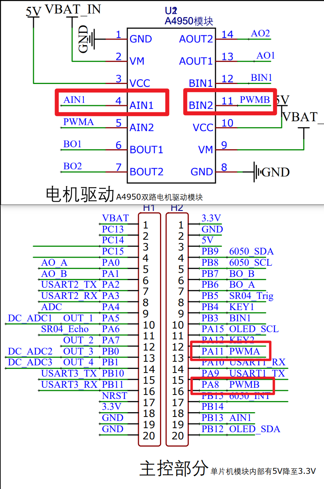

我们这先介绍原因:

原因1：介绍电机驱动后，我们会说明

原因2: 因为**STM32中文参考手册**介绍了，TIM1_CH1和TIM1_CH4可以复用功能重映射到PA8和PA11

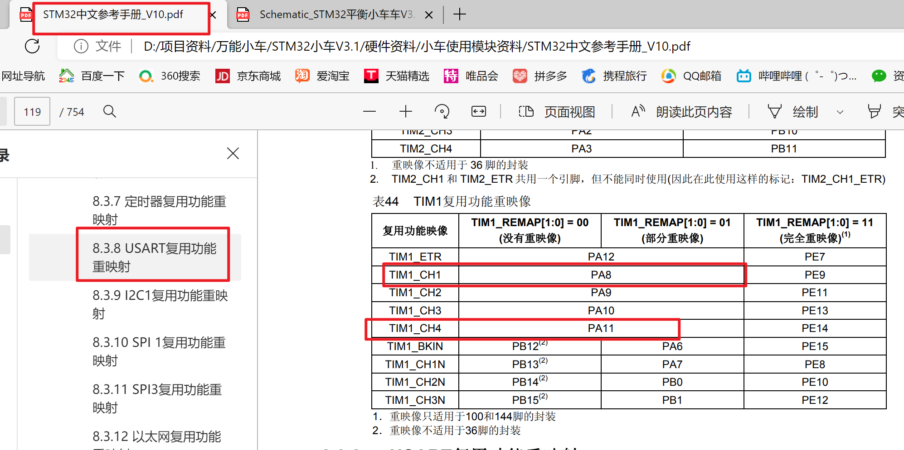

我们使用软件配置 **PA11和PA8**这里配置

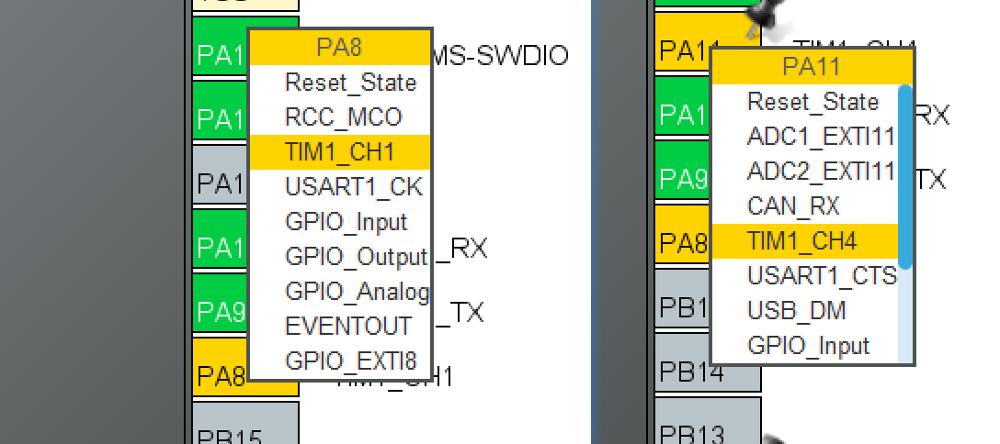


然后我们生成代码

PWM输出的配置就已经完成了，但是不能输出产生PWM波，因为Cube在生成代码时，有很多外设初始化完后默认是关闭的，需要我们手动开启。

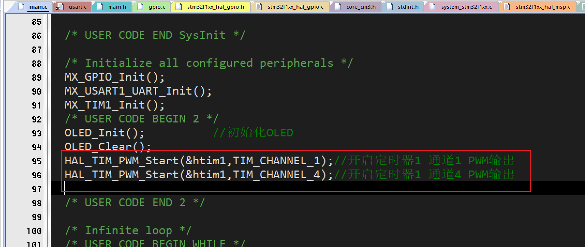

```C
  HAL_TIM_PWM_Start(&htim1,TIM_CHANNEL_1);//开启定时器1 通道1 PWM输出
  HAL_TIM_PWM_Start(&htim1,TIM_CHANNEL_4);//开启定时器1 通道4 PWM输出
```

我们软件仿真一下、查看PA11与PA8波形


那么频率就是 1/0.002 = 500HZ

这就是我们要设置的

我们可以使用这个宏来修改占空比

```c
 __HAL_TIM_SET_COMPARE(&htim1, TIM_CHANNEL_1, 40);
```


## 5.3-PWM测试方法

上面我们生成了PWM下面我们测试一下

### KEIL软件仿真方法:

软件模拟仿真不需要任何硬件-下面是官方介绍


选择软件仿真


```c
DARMSTM.DLL
-pSTM32F103C8
```

设置时钟频率-板子外部晶振8Mhz 这里我们选择8Mhz

(新版的keil5里没有那个设置频率的功能)


开启仿真


打开逻辑分析仪器


添加要观察的引脚


点击全速运行


### 使用仿真器硬件仿真

选择仿真器仿真-检测已经识别出芯片ID


一样的可以开启仿真


但是硬件仿真好像目前还不能使用过逻辑分析仪、但是硬件仿真是在硬件上跑的，可以向硬件输入数据或者由硬件输出数据、比如按键仿真的时候就可以使用硬件仿真。

### 使用示波器工具测量波形(非重点)

# 第六章-电机驱动和PWM

## 6.1-认识电机驱动

示波器、硬件仿真、软件仿真

项目使用电机驱动芯片为A4950、下面是电机驱动的相关介绍

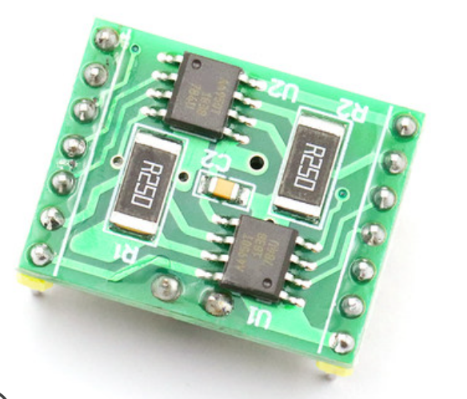

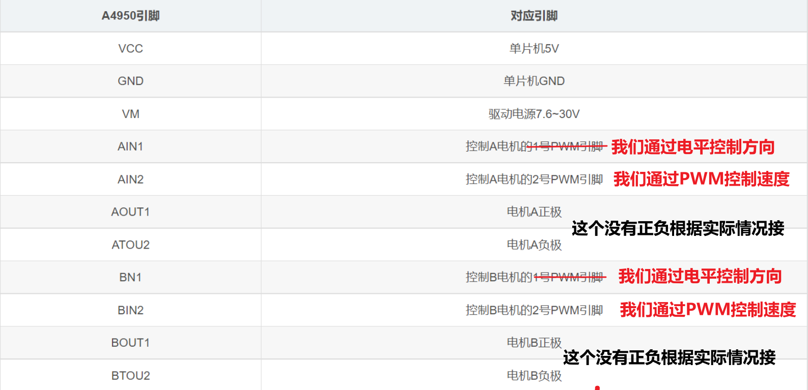

我们按照这种使用方法

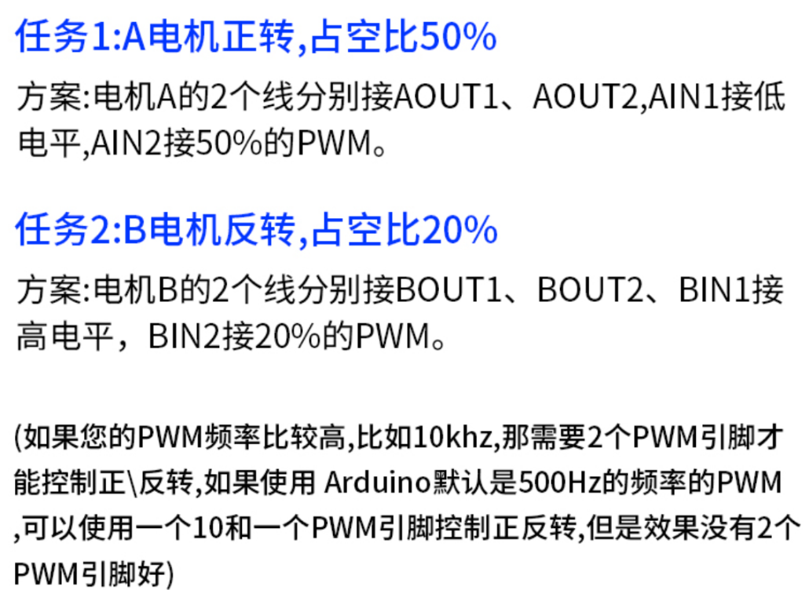

这我们使用一个图介绍


## 6.2-使用电机驱动(独立工程)

### 分析和编写代码

综合电机使用方法、C8T6单片机硬件资源、小车原理图我们要进行如下配置

**PA11-TIM1_CH4 定时器PWM输出-PWMA 前面已经完成**

**PB13-GPIO输出-AIN1**

**PA8-TIM1_CH1 定时器PWM输出-PWMB  前面已经完成**

**PB3-GPIO输出-BIN1**

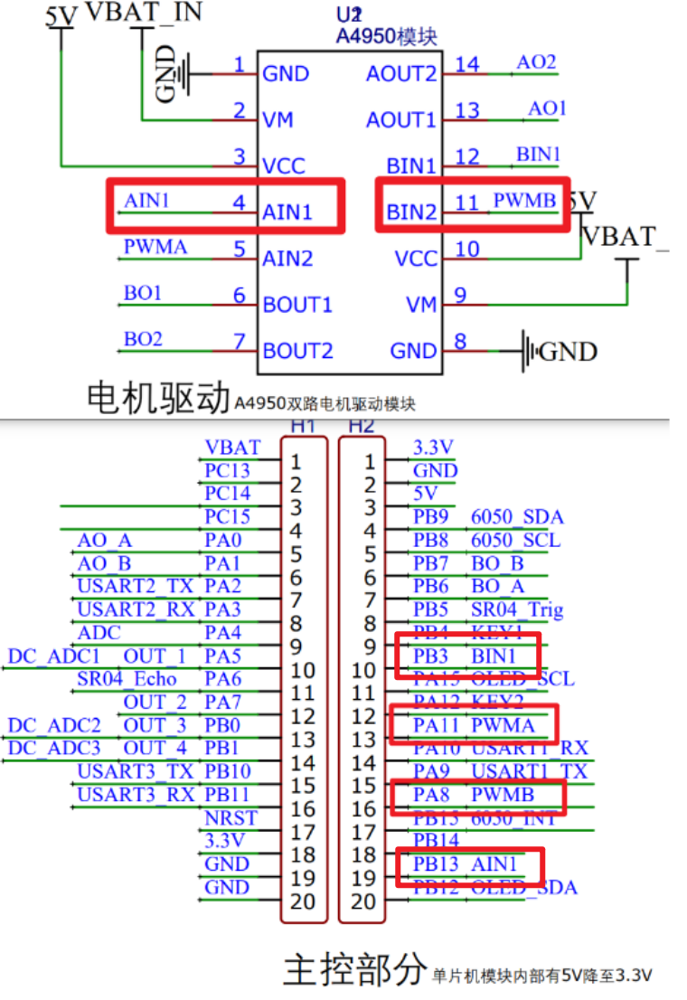

还有两个管脚没有初始化


生成代码

开始添加控制电机正反转与速度的代码，进行仿真和电机测试，示波器测量

添加AIN1、BIN1控制代码


```c
	HAL_GPIO_WritePin(AIN1_GPIO_Port,AIN1_Pin,GPIO_PIN_RESET);//设置AIN1 PB13为 低电平
	HAL_GPIO_WritePin(BIN1_GPIO_Port,BIN1_Pin,GPIO_PIN_SET);  //设置BIN1 PB3为高电平
	HAL_Delay(1000);
	//两次会使得电机反向。
	HAL_GPIO_WritePin(AIN1_GPIO_Port,AIN1_Pin,GPIO_PIN_SET);//设置AIN1 PB13为 高电平
	HAL_GPIO_WritePin(BIN1_GPIO_Port,BIN1_Pin,GPIO_PIN_RESET);  //设置BIN1 PB3为低电平
```

### 仿真测试代码

使用软件仿真

检测是否软件仿真设置正确


开启仿真-添加PB13和PB3到逻辑分析仪


全速仿真运行


### 实物测试代码

如何让电机90%电压转速 旋转

烧录代码

## 6.3-编写电机转速开环控制函数(另外复制工程)

新建motor文件


包含文件并添加编译


为了方便移植和使用，我们GPIO电平控制写成宏


```c
#define AIN1_RESET  HAL_GPIO_WritePin(AIN1_GPIO_Port,AIN1_Pin,GPIO_PIN_RESET)//设置AIN1 PB13为 低电平
#define AIN1_SET    HAL_GPIO_WritePin(AIN1_GPIO_Port,AIN1_Pin,GPIO_PIN_SET)//设置AIN1 PB13为 高电平

#define BIN1_RESET 	HAL_GPIO_WritePin(BIN1_GPIO_Port,BIN1_Pin,GPIO_PIN_RESET)  //设置BIN1 PB3为低电平
#define BIN1_SET    HAL_GPIO_WritePin(BIN1_GPIO_Port,BIN1_Pin,GPIO_PIN_SET)//设置AIN1 PB13为 高电平

```

下面我们编写小车电机方向和速度控制

```c
/*******************
*  @brief  设置两个电机转速和方向
*  @param  motor1:电机B设置参数、motor2:设置参数
*  @param  motor1: 输入1~100 对应控制B电机正方向速度在1%-100%、输入-1~-100 对应控制B电机反方向速度在1%-100%、motor2同理
*  @return  无
*
*******************/
void Motor_Set (int motor1,int motor2)
{
	//根据参数正负 设置选择方向
	if(motor1 < 0) BIN1_SET;
	   else      BIN1_RESET;
	if(motor2 < 0) AIN1_SET;
		else      AIN1_RESET;
	
	//motor1 设置电机B的转速
	if(motor1 < 0)
	{
		if(motor1 < -99) motor1 = -99;//超过PWM幅值
		//负的时候绝对值越小  PWM占空比越大
		//现在的motor1      -1   -99
		//给寄存器或者函数  99  1 
		 __HAL_TIM_SET_COMPARE(&htim1, TIM_CHANNEL_1, (100+motor1));//修改定时器1 通道1 PA8 Pulse改变占空比
	}
	else{
		if(motor1 > 99) motor1 = 99;
		//现在是   0 1  99
		//我们赋值 0 1 99
		 __HAL_TIM_SET_COMPARE(&htim1, TIM_CHANNEL_1, motor1);//修改定时器1 通道1 PA8 Pulse改变占空比
	}
	
	//motor2 设置电机A的转速
	if(motor2 < 0)
	{
		if(motor2 < -99) motor2 = -99;//超过PWM幅值
		//负的时候绝对值越小  PWM占空比越大
		//现在的motor2      -1   -99
		//给寄存器或者函数   99  1 
		__HAL_TIM_SET_COMPARE(&htim1, TIM_CHANNEL_4, (100+motor2));//修改定时器1 通道4 PA11 Pulse改变占空比
	}
	else{
		if(motor2 > 99) motor2 = 99;
		//现在是   0 1 99
		//我们赋值 0 1 99
		 __HAL_TIM_SET_COMPARE(&htim1, TIM_CHANNEL_4, motor2);//修改定时器1 通道4 PA11 Pulse改变占空比

	}

}  
```

然后我们连接电机主函数进行测试

```c
	HAL_Delay(500);
	Motor_Set(0,0);
```

# 第七章-编码器测速

## 7.1-认识编码器

编码器:一般按照电机尾部、用于测量电机转速、方向、位置。


那么编码器的输出信号具体是什么？我们如何根据输出信号测量转速 和方向？

转速:  单位时间测量到的脉冲数量(比如根据每秒测量到多少个脉冲来计算转速)

旋转方向: 两通道信号的相对电平关系

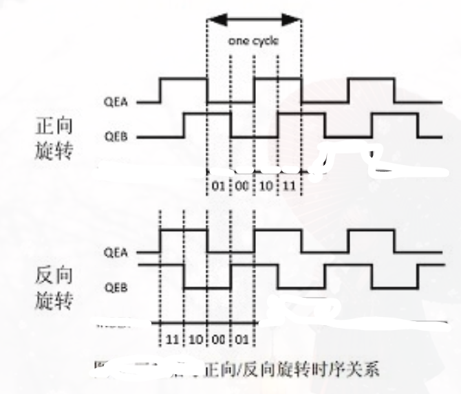


## 7.2单片机定时器的编码器功能

那么我们已经知道编码器输出的波形，我们如何通过单片机读取波形，然后计算出速度那?

这里STM32单片机的定时器和通用定时器具有**编码器接口模式**、在STM32中文参考手册13章中有详细介绍

STM32中文参考手册-第200页

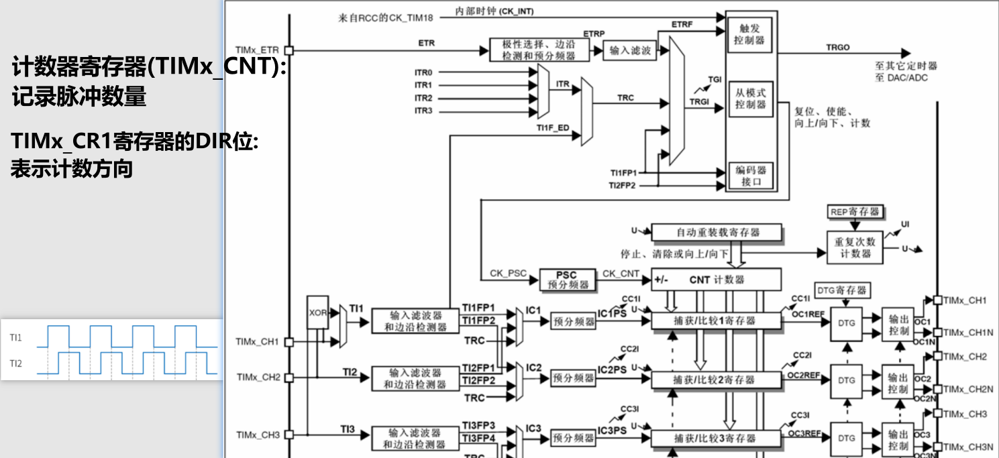

STM32中文参考手册-第267页


STM32中文参考手册-第226页

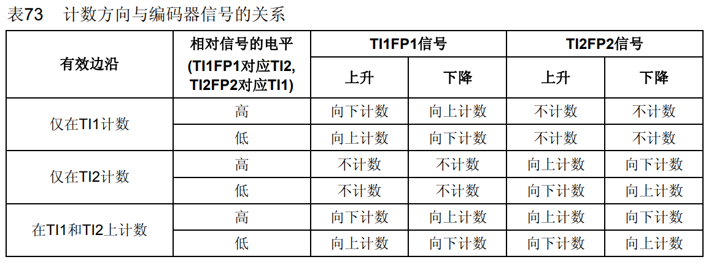

这个是计数方向与编码器信号的关系、我们拆开来看

仅在TI1计数、电机正转、对原始数据二倍频

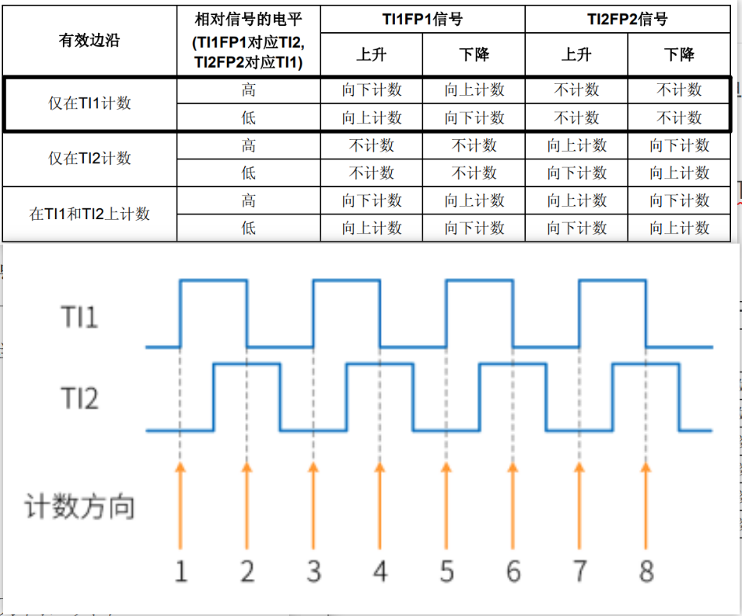

仅在TI1计数、电机反转、对原始数据二倍频

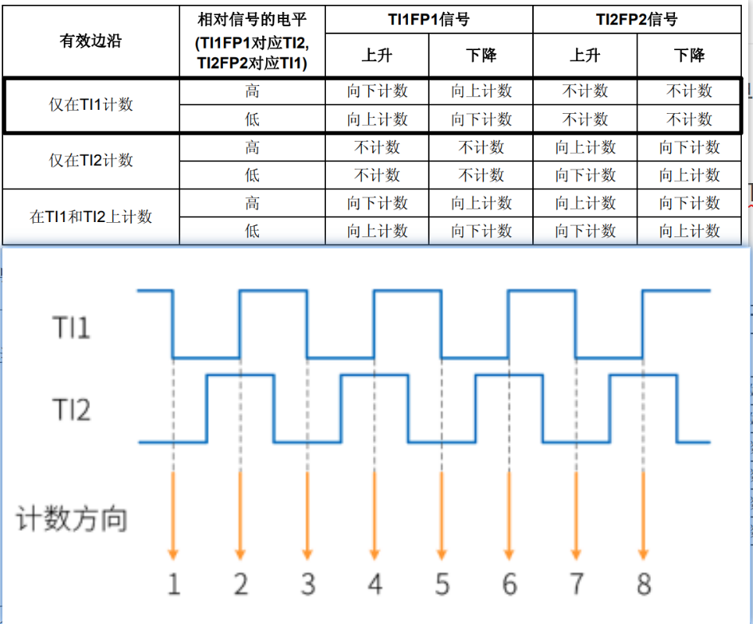

在TI1和TI2都计数

可以看到这样就对原始数据四倍频了

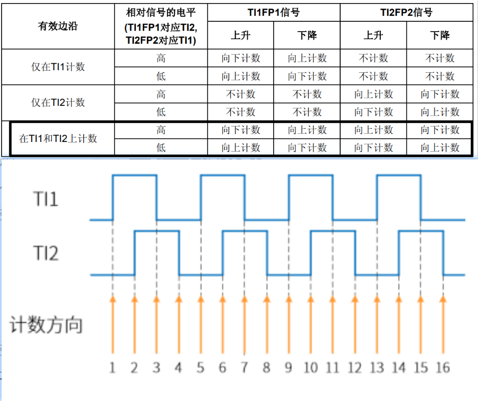

计数方向

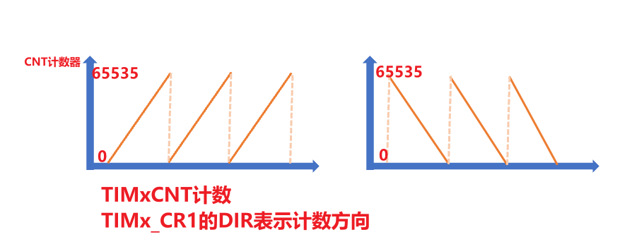


## 7.3-获得单位时间计数器值变化量


**上一次说的方法：**

这次编码器计数值 = 计数器值+计数溢出次数 * 计数最大器计数最大值

计数器两次变化值 = 这次编码器计数值 - 上次编码器计数值

然后根据这个单位变化量计算速度

**还有一种方法：**

计数器变化量 = 当前计数器值

每次计数值清空

然后根据这个变化量 计算速度

然后我们再看具体到哪一款电机和编码器上如何测速


在STM32中文参考手册-第119页


设置TIM2


设置ITM2滤波器


同理设置TIM4


设置TIM4滤波器


设置引脚上拉


生成代码


开启定时器和定时中断


```c
  HAL_TIM_Encoder_Start(&htim2,TIM_CHANNEL_ALL);//开启定时器2
  HAL_TIM_Encoder_Start(&htim4,TIM_CHANNEL_ALL);//开启定时器4
  HAL_TIM_Base_Start_IT(&htim2);				//开启定时器2 中断
  HAL_TIM_Base_Start_IT(&htim4);                //开启定时器4 中断
```

在定义两个变量保存计数器值


```c
short Encoder1Count = 0;//编码器计数器值
short Encoder2Count = 0;
```

每2ms读取计数器值->清零计数器


```c
	Motor_Set(0,0);
	//1.保存计数器值
	Encoder1Count =(short)__HAL_TIM_GET_COUNTER(&htim4);
	Encoder2Count =(short)__HAL_TIM_GET_COUNTER(&htim2);
	//2.清零计数器值
	__HAL_TIM_SET_COUNTER(&htim4,0);
	__HAL_TIM_SET_COUNTER(&htim2,0);
	
	printf("Encoder1Count:%d\r\n",Encoder1Count);
	printf("Encoder2Count:%d\r\n",Encoder2Count);	
	
	HAL_Delay(2);
```

接好电池、烧录代码、串口一连接电脑

用手转动电机1或者电机2 、串口助手可以看到输出信息了


## 7.4-主函数周期测量转速

上面我们测量出来了溢出值，我们再根据当前计数器值就可以测量出计数器变化量，我们通过单位时间变量就可以计算出转速

下面是电机和编码器的参数


我们先测试的结论是否有问题？

1. 编码器计数器会不会在计数时间内溢出？
2. 车轮旋转一周，单片机编码器计数器计数多少？9.6乘11乘4
3. 根据计算方法计算电机转速

定义两个float变量


```c
float Motor1Speed = 0.00;
float Motor2Speed = 0.00;
```

下面是代码(一定要把主函数没有用的删除掉)


```c
	//计算速度
	Motor1Speed = (float)Encode1Count*100/9.6/11/4;
	Motor2Speed = (float)Encode2Count*100/9.6/11/4;
	
	printf("Motor1Speed:%.2f\r\n",Motor1Speed);
	printf("Motor2Speed:%.2f\r\n",Motor2Speed);
```

编译烧录代码就会输出结果


## 7.5-定时器中断定时测量速度

上面我们实现:在主函数周期，读取计数器值然后计算速度，但是如果函数加入其他内容这个周期时间就很难保证。

所以这节我们通过定时器，周期读取计数器，计算速度。复制一份工程开始搞!


我们先开启定时器、2ms进入一次定时器中断，中断回调函数执行咱们的代码即可。

为什么充分利用单片机 我们使用TIM1

2. 设置内部时钟源
3. 使能自动重装载


开启定义更新中断


代码开启定时器1 中断


```c
  HAL_TIM_Base_Start_IT(&htim1);                //开启定时器1 中断
```

定时器回调函数中添加 速度计算内容


```c
/*******************
*  @brief  定时器回调函数
*  @param  
*  @return  
*
*******************/
void HAL_TIM_PeriodElapsedCallback(TIM_HandleTypeDef *htim)
{
	if(htim == &htim1)//htim1 500HZ  2ms 中断一次
	{
		TimerCount++;
		if(TimerCount %5 == 0)//每10ms执行一次
		{
			Encode1Count = (short)__HAL_TIM_GET_COUNTER(&htim4);
			Encode2Count = (short)__HAL_TIM_GET_COUNTER(&htim2);
			__HAL_TIM_SET_COUNTER(&htim4,0);
			__HAL_TIM_SET_COUNTER(&htim2,0);
			
			Motor1Speed = (float)Encode1Count*100/9.6/11/4;
			Motor2Speed = (float)Encode2Count*100/9.6/11/4;

			TimerCount=0;
		}
	}
}
```

把之前的变量定义放这里


```C
short Encode1Count = 0;
short Encode2Count = 0;
float Motor1Speed = 0.00;
float Motor2Speed = 0.00;
uint16_t TimerCount=0;
```

主函数就输出速度大小就可以了


```c
	printf("Motor1Speed:%.2f\r\n",Motor1Speed);
	printf("Motor2Speed:%.2f\r\n",Motor2Speed);
```

把变量需要声明一下


```C
extern float Motor1Speed ;
extern float Motor2Speed ;
```

然后打开串口助手


注:

根据电机和实际小车调整速度测量与占空比设置函数


# 第八章-PID-速度控制

## 8.1-速度控制探索

前面我们已经能够通过编码器测量出速度值，下面我们来控制速度

我们先编写一个简单的控制方法

要求：讲转速控制再2.9-3.1转每秒

可以把中断里面不重要的输出注释掉


```C
	if(Motor1Speed>3.1) Motor1Pwm--;
	if(Motor1Speed<2.9) Motor1Pwm++;
	if(Motor2Speed>3.1) Motor2Pwm--;
	if(Motor2Speed<2.9) Motor2Pwm++;
	Motor_Set(Motor1Pwm,Motor2Pwm);
	printf("Motor1Speed:%.2f Motor1Pwm:%d\r\n",Motor1Speed,Motor1Pwm);
	printf("Motor2Speed:%.2f Motor2Pwm:%d\r\n",Motor2Speed,Motor2Pwm);
	
	HAL_Delay(100);
```

开始实验


现象就开始电机没有到达3转每秒，PWM占空比逐渐增大，电机**逐渐**达到要求转速、到达要求转速后我们增加阻力，电机**变慢**，阻力大小不边PWM占空比逐渐更大转速**逐渐更大**。

这样我们就把转速控制到我们想要的范围，但是我们并不满意、能够看出来控制的速度很慢，给电机一些阻力电机至少要2-3秒能够调整过来，这在一些场景是不允许的。

我们理想的控制效果是：在电机转速很慢的是时候能快速调整，在电机一直转的不能达到要求时候能够更快速度调整

## 8.2-准备工作-匿名上位机曲线显示速度波形方便观察数据

为了方便观察电机速度数据，我们通过上位机曲线显示一下。

这里我们使用的上位机是匿名上位机-大佬写的非常稳定功能也很多

我使用的版本是:**匿名上位机V7.2.2.8版本**推荐大家和我使用一样

匿名上位机官方下载链接:http://www.anotc.com/wiki/%E5%8C%BF%E5%90%8D%E4%BA%A7%E5%93%81%E8%B5%84%E6%96%99/%E8%B5%84%E6%96%99%E4%B8%8B%E8%BD%BD%E9%93%BE%E6%8E%A5%E6%B1%87%E6%80%BB

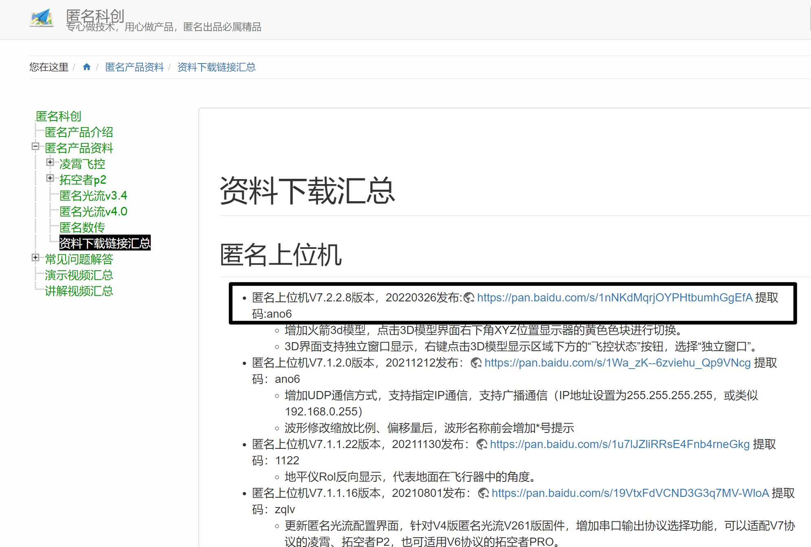

我们要把STM32数据发送到匿名上位机，就要满足匿名上位机的数据协议要求

在匿名上位机资料下载链接，可以下载到协议介绍

- 匿名上位机V7通信协议，20210528发布：https://pan.baidu.com/s/1nGrIGWj6qr9DWOcGpKR51g 提取码：z8d1
- CSDN [慕羽★](https://blog.csdn.net/qq_44339029)大佬写的协议解析教程博客:https://blog.csdn.net/qq_44339029/article/details/106004997

**1.先补充一下大小端模式**

这是因为在计算机系统中，我们是以字节为单位的，每个地址单元都对应着一个字节，一个字节为 8bit。但是在C语言中除了8bit的char之外，还有16bit的short型，32bit的long型（要看具体的编译器），另外，对于位数大于8位的处理器，例如16位或者32位的处理器，由于寄存器宽度大于一个字节，那么**必然存在着一个如和将多个字节安排的问题**。因此就导致了大端存储模式和小端存储模式。例如一个16bit的short型x，在内存中的地址为0x0010，x的值为0x1122，那么0x11为高字节，0x22为低字节。对于大端模式，就将0x11放在低地址中，即0x0010中，0x22放在高地址中，即0x0011中。

- **所谓的大端模式（BE big-endian），是指数据的低位保存在内存的高地址中，而数据的高位，保存在内存的低地址中（低对高，高对低）；**

- **所谓的小端模式（LE little-endian），是指数据的低位保存在内存的低地址中，而数据的高位保存在内存的高地址中（低对低，高对高）。**

  ##### 常见的[单片机](https://so.csdn.net/so/search?q=单片机&spm=1001.2101.3001.7020)大小端模式：（1）KEIL C51中，变量都是大端模式的，而KEIL MDK中，变量是小端模式的。（2）SDCC-C51是小端寻址，AVRGCC 小端寻址.（3）PC小端，大部分ARM是小端 （4）总起来说51单片机一般是大端模式，32单片机一般是小端模式.


**2.看一下上位机要求的协议**

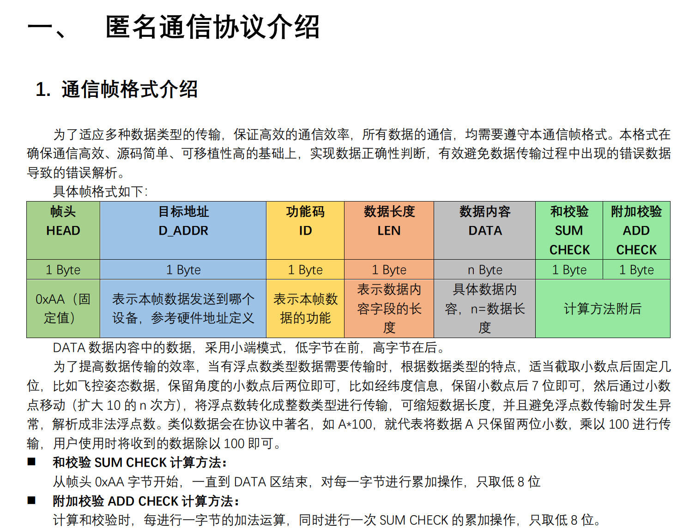

灵活格式帧(用户自定义帧)

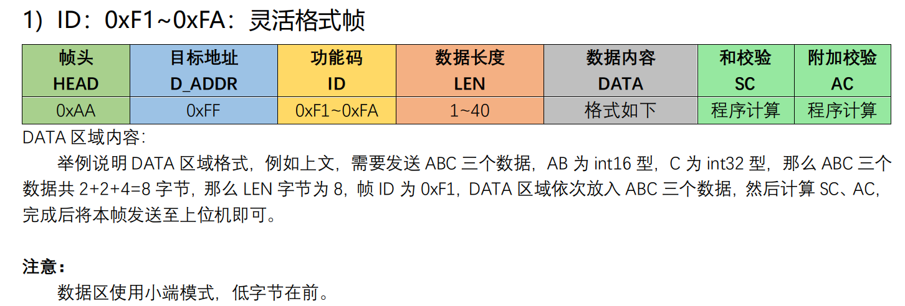

前面我们好理解

0xAA:一个字节表示开始

0xFF:一个字节表示目标地址

0xF1:一个字节表示发送功能码

1-40：一个字节表示数据长度

数据内容有多个字节如何发送

**因为串口每次发送一个字节，但是数据可能是int16_t 16位的数据，或者int32_t 32位数据，每次发送16位数据,先发送数据低八位，还是先发送数据高八位那?**

匿名协议通信介绍给出：**DATA 数据内容中的数据，采用小端模式传送，低字节在前，高字节在后。**

那么就要求，比如我们在发送16位数据0x2314我们要先发送低字节0x14,然后发送高字节0x23

那么如何解析出低字节或者高字节，就需要知道多字节数据在单片机里面是怎么存的，因为STM32是小端存储，所以低字节就在低位地址中，高字节高位地址中。

如果使用32单片机 小端模式，0x23高地址，0x14在低地址，所以我们要先发低地址，再发高地址。

下面就是对16位数据，或者32位数据的拆分

```C
//需要发送16位,32位数据，对数据拆分，之后每次发送单个字节
//拆分过程：对变量dwTemp 去地址然后将其转化成char类型指针，最后再取出指针所指向的内容
#define BYTE0(dwTemp)  (*(char *)(&dwTemp))
#define BYTE1(dwTemp)  (*((char *)(&dwTemp) + 1))
#define BYTE2(dwTemp)  (*((char *)(&dwTemp) + 2))
#define BYTE3(dwTemp)  (*((char *)(&dwTemp) + 3))
```

拆分后我们按照协议要求发送数据就可以了


niming.c

```c
#include "niming.h"
#include "main.h"
#include "usart.h"
uint8_t data_to_send[100];

//通过F1帧发送4个uint16类型的数据
void ANO_DT_Send_F1(uint16_t _a, uint16_t _b, uint16_t _c, uint16_t _d)
{
    uint8_t _cnt = 0;		//计数值
    uint8_t sumcheck = 0;  //和校验
    uint8_t addcheck = 0; //附加和校验
    uint8_t i = 0;
	data_to_send[_cnt++] = 0xAA;//帧头
    data_to_send[_cnt++] = 0xFF;//目标地址
    data_to_send[_cnt++] = 0xF1;//功能码
    data_to_send[_cnt++] = 8; //数据长度
	//单片机为小端模式-低地址存放低位数据，匿名上位机要求先发低位数据，所以先发低地址
	data_to_send[_cnt++] = BYTE0(_a);       
    data_to_send[_cnt++] = BYTE1(_a);
	
    data_to_send[_cnt++] = BYTE0(_b);
    data_to_send[_cnt++] = BYTE1(_b);
	
    data_to_send[_cnt++] = BYTE0(_c);
    data_to_send[_cnt++] = BYTE1(_c);
	
    data_to_send[_cnt++] = BYTE0(_d);
    data_to_send[_cnt++] = BYTE1(_d);
	 for ( i = 0; i < data_to_send[3]+4; i++)
    {
        sumcheck += data_to_send[i];//和校验
        addcheck += sumcheck;//附加校验
    }
    data_to_send[_cnt++] = sumcheck;
    data_to_send[_cnt++] = addcheck;
	HAL_UART_Transmit(&huart1,data_to_send,_cnt,0xFFFF);//这里是串口发送函数
}
//，通过F2帧发送4个int16类型的数据
void ANO_DT_Send_F2(int16_t _a, int16_t _b, int16_t _c, int16_t _d)   //F2帧  4个  int16 参数
{
    uint8_t _cnt = 0;
    uint8_t sumcheck = 0; //和校验
    uint8_t addcheck = 0; //附加和校验
    uint8_t i=0;
   data_to_send[_cnt++] = 0xAA;
    data_to_send[_cnt++] = 0xFF;
    data_to_send[_cnt++] = 0xF2;
    data_to_send[_cnt++] = 8; //数据长度
	//单片机为小端模式-低地址存放低位数据，匿名上位机要求先发低位数据，所以先发低地址
    data_to_send[_cnt++] = BYTE0(_a);
    data_to_send[_cnt++] = BYTE1(_a);
	
    data_to_send[_cnt++] = BYTE0(_b);
    data_to_send[_cnt++] = BYTE1(_b);
	
    data_to_send[_cnt++] = BYTE0(_c);
    data_to_send[_cnt++] = BYTE1(_c);
	
    data_to_send[_cnt++] = BYTE0(_d);
    data_to_send[_cnt++] = BYTE1(_d);
	
	  for ( i = 0; i < data_to_send[3]+4; i++)
    {
        sumcheck += data_to_send[i];
        addcheck += sumcheck;
    }

    data_to_send[_cnt++] = sumcheck;
    data_to_send[_cnt++] = addcheck;
	
	HAL_UART_Transmit(&huart1,data_to_send,_cnt,0xFFFF);//这里是串口发送函数
}
//通过F3帧发送2个int16类型和1个int32类型的数据
void ANO_DT_Send_F3(int16_t _a, int16_t _b, int32_t _c )   //F3帧  2个  int16 参数   1个  int32  参数
{
    uint8_t _cnt = 0;
    uint8_t sumcheck = 0; //和校验
    uint8_t addcheck = 0; //附加和校验
    uint8_t i=0;
    data_to_send[_cnt++] = 0xAA;
    data_to_send[_cnt++] = 0xFF;
    data_to_send[_cnt++] = 0xF3;
    data_to_send[_cnt++] = 8; //数据长度
	//单片机为小端模式-低地址存放低位数据，匿名上位机要求先发低位数据，所以先发低地址
    data_to_send[_cnt++] = BYTE0(_a);
    data_to_send[_cnt++] = BYTE1(_a);
	
    data_to_send[_cnt++] = BYTE0(_b);
    data_to_send[_cnt++] = BYTE1(_b);
	
    data_to_send[_cnt++] = BYTE0(_c);
    data_to_send[_cnt++] = BYTE1(_c);
    data_to_send[_cnt++] = BYTE2(_c);
    data_to_send[_cnt++] = BYTE3(_c);
	
	  for ( i = 0; i < data_to_send[3]+4; i++)
    {
        sumcheck += data_to_send[i];
        addcheck += sumcheck;
    }

    data_to_send[_cnt++] = sumcheck;
    data_to_send[_cnt++] = addcheck;

	HAL_UART_Transmit(&huart1,data_to_send,_cnt,0xFFFF);//这里是串口发送函数
}

```

niming.h

```c
#ifndef  NIMING_H
#define  NIMING_H
#include "main.h"
//需要发送16位,32位数据，对数据拆分，之后每次发送单个字节
//拆分过程：对变量dwTemp 去地址然后将其转化成char类型指针，最后再取出指针所指向的内容
#define BYTE0(dwTemp)  (*(char *)(&dwTemp))
#define BYTE1(dwTemp)  (*((char *)(&dwTemp) + 1))
#define BYTE2(dwTemp)  (*((char *)(&dwTemp) + 2))
#define BYTE3(dwTemp)  (*((char *)(&dwTemp) + 3))


void ANO_DT_Send_F1(uint16_t, uint16_t _b, uint16_t _c, uint16_t _d);
void ANO_DT_Send_F2(int16_t _a, int16_t _b, int16_t _c, int16_t _d);
void ANO_DT_Send_F3(int16_t _a, int16_t _b, int32_t _c );

#endif 

```

添加测试代码


```c
	//电机速度等信息发送到上位机
	//注意上位机不支持浮点数，所以要乘100
	ANO_DT_Send_F2(Motor1Speed*100, 3.0*100,Motor2Speed*100,3.0*100);
```

下面设置上位机-数据解析


这个是控制效果，并不理想，后面我们介绍PID控制


## 8.3-P I D 逐个参数理解

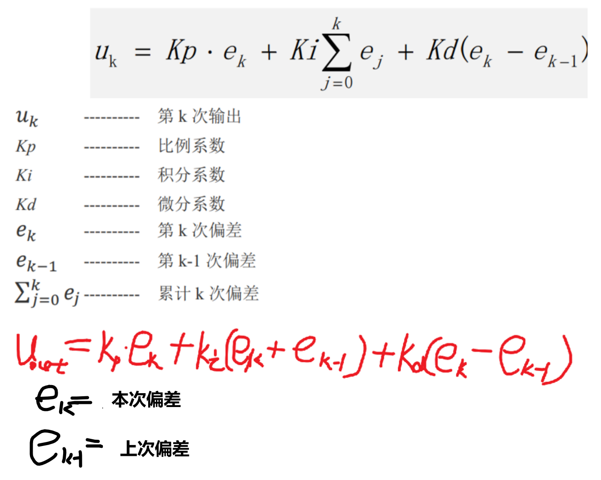

加入的现在 过去 未来概念

p:现在

i:过去

d:未来


那么我们就开始写PID

PID的结构体类型变量、里面成员都是浮点类型

先在pid.h声明一个结构体类型、声明.c中的函数


```c
#ifndef __PID_H
#define __PID_H

//声明一个结构体类型
typedef struct 
{
	float target_val;//目标值
	float actual_val;//实际值
	float err;//当前偏差
	float err_last;//上次偏差
	float err_sum;//误差累计值
	float Kp,Ki,Kd;//比例，积分，微分系数
	
} tPid;

//声明函数
float P_realize(tPid * pid,float actual_val);
void PID_init(void);
float PI_realize(tPid * pid,float actual_val);
float PID_realize(tPid * pid,float actual_val);
#endif

```

然后在pid.c中定义结构体类型变量


```c
#include "pid.h"

//定义一个结构体类型变量
tPid pidMotor1Speed;
//给结构体类型变量赋初值
void PID_init()
{
	pidMotor1Speed.actual_val=0.0;
	pidMotor1Speed.target_val=0.00;
	pidMotor1Speed.err=0.0;
	pidMotor1Speed.err_last=0.0;
	pidMotor1Speed.err_sum=0.0;
	pidMotor1Speed.Kp=0;
	pidMotor1Speed.Ki=0;
	pidMotor1Speed.Kd=0;
}
//比例p调节控制函数
float P_realize(tPid * pid,float actual_val)
{
	pid->actual_val = actual_val;//传递真实值
	pid->err = pid->target_val - pid->actual_val;//当前误差=目标值-真实值
	//比例控制调节   输出=Kp*当前误差
	pid->actual_val = pid->Kp*pid->err;
	return pid->actual_val;
}
//比例P 积分I 控制函数
float PI_realize(tPid * pid,float actual_val)
{
	pid->actual_val = actual_val;//传递真实值
	pid->err = pid->target_val - pid->actual_val;//当前误差=目标值-真实值
	pid->err_sum += pid->err;//误差累计值 = 当前误差累计和
	//使用PI控制 输出=Kp*当前误差+Ki*误差累计值
	pid->actual_val = pid->Kp*pid->err + pid->Ki*pid->err_sum;
	
	return pid->actual_val;
}
// PID控制函数
float PID_realize(tPid * pid,float actual_val)
{
	pid->actual_val = actual_val;//传递真实值
	pid->err = pid->target_val - pid->actual_val;////当前误差=目标值-真实值
	pid->err_sum += pid->err;//误差累计值 = 当前误差累计和
	//使用PID控制 输出 = Kp*当前误差  +  Ki*误差累计值 + Kd*(当前误差-上次误差)
	pid->actual_val = pid->Kp*pid->err + pid->Ki*pid->err_sum + pid->Kd*(pid->err - pid->err_last);
	//保存上次误差: 这次误差赋值给上次误差
	pid->err_last = pid->err;
	
	return pid->actual_val;
}

```

然后在main中要调用PID_init();函数


```c
  PID_init();
```

**p调节函数**函数只根据当前误差进行控制

```c
//比例p调节控制函数
float P_realize(tPid * pid,float actual_val)
{
	pid->actual_val = actual_val;//传递真实值
	pid->err = pid->target_val - pid->actual_val;//目标值减去实际值等于误差值
	//比例控制调节
	pid->actual_val = pid->Kp*pid->err;
	return pid->actual_val;
}
```

主函数-可以估算当p=10 就有较好的响应速度

先看根据p比例控制的效果


p调节 电机稳态后还是存在误差。

下面加入i 调节也就是加入历史误差

**pi的控制函数**

```c
//比例P 积分I 控制函数
float PI_realize(tPid * pid,float actual_val)
{
	pid->actual_val = actual_val;//传递真实值
	pid->err = pid->target_val - pid->actual_val;//目标值减去实际值等于误差值
	pid->err_sum += pid->err;//误差累计求和
	//使用PI控制
	pid->actual_val = pid->Kp*pid->err + pid->Ki*pid->err_sum;
	
	return pid->actual_val;
}
```

因为实际值1.6的时候误差为1.4 上次偏差1.4和这次偏差1.4相加2.8 我们乘5 等于10点多就会有较好控制效果

这是pi 调节的控制效果


**下面是PID调节的**

```c
// PID控制函数
float PID_realize(tPid * pid,float actual_val)
{
	pid->actual_val = actual_val;//传递真实值
	pid->err = pid->target_val - pid->actual_val;//目标值减去实际值等于误差值
	pid->err_sum += pid->err;//误差累计求和
	//使用PID控制
	pid->actual_val = pid->Kp*pid->err + pid->Ki*pid->err_sum + pid->Kd*(pid->err - pid->err_last);
	//保存上次误差:最近一次 赋值给上次
	pid->err_last = pid->err;
	
	return pid->actual_val;
}
```


## 8.4-加入cJSON方便上位机调参


调大堆栈


软件开启中断

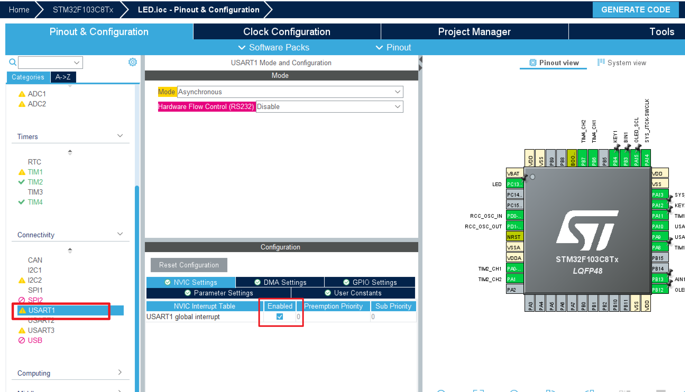

开启接收中断


```c
 __HAL_UART_ENABLE_IT(&huart1,UART_IT_RXNE);	//开启串口1接收中断
```

中断回调函数


```c
uint8_t Usart1_ReadBuf[256];	//串口1 缓冲数组
uint8_t Usart1_ReadCount = 0;	//串口1 接收字节计数
  if(__HAL_UART_GET_FLAG(&huart1,UART_FLAG_RXNE))//判断huart1 是否读到字节
  {
		if(Usart1_ReadCount >= 255) Usart1_ReadCount = 0;
		HAL_UART_Receive(&huart1,&Usart1_ReadBuf[Usart1_ReadCount++],1,1000);
  }
```

编写函数用于判断串口是否发送完一帧数据


```C
extern uint8_t Usart1_ReadBuf[255];	//串口1 缓冲数组
extern uint8_t Usart1_ReadCount;	//串口1 接收字节计数

//判断否接收完一帧数据
uint8_t Usart_WaitReasFinish(void)
{
	static uint16_t Usart_LastReadCount = 0;//记录上次的计数值
	if(Usart1_ReadCount == 0)
	{
		Usart_LastReadCount = 0;
		return 1;//表示没有在接收数据
	}
	if(Usart1_ReadCount == Usart_LastReadCount)//如果这次计数值等于上次计数值
	{
		Usart1_ReadCount = 0;
		Usart_LastReadCount = 0;
		return 0;//已经接收完成了
	}
	Usart_LastReadCount = Usart1_ReadCount;
	return 2;//表示正在接受中
}
```

然后我们把cJSON库放入工程里面

下载cJSON新版

gtihub链接:https://github.com/DaveGamble/cJSON

百度网盘链接：https://pan.baidu.com/s/1AcNHtZuv5bokMQ2f6QoG7Q

提取码：a422

和添加其他文件一样，加入工程，然后指定路径

编写解析指令的函数


```c
#include "cJSON.h"
#include <string.h>
   cJSON *cJsonData ,*cJsonVlaue;

	if(Usart_WaitReasFinish() == 0)//是否接收完毕
	{
		cJsonData  = cJSON_Parse((const char *)Usart1_ReadBuf);
		if(cJSON_GetObjectItem(cJsonData,"p") !=NULL)
		{
			cJsonVlaue = cJSON_GetObjectItem(cJsonData,"p");	
		    p = cJsonVlaue->valuedouble;
			pidMotor1Speed.Kp = p;
		}
		if(cJSON_GetObjectItem(cJsonData,"i") !=NULL)
		{
			cJsonVlaue = cJSON_GetObjectItem(cJsonData,"i");	
		    i = cJsonVlaue->valuedouble;
			pidMotor1Speed.Ki = i;
		}
		if(cJSON_GetObjectItem(cJsonData,"d") !=NULL)
		{
			cJsonVlaue = cJSON_GetObjectItem(cJsonData,"d");	
		    d = cJsonVlaue->valuedouble;
			pidMotor1Speed.Kd = d;
		}
		if(cJSON_GetObjectItem(cJsonData,"a") !=NULL)
		{
		
			cJsonVlaue = cJSON_GetObjectItem(cJsonData,"a");	
		    a = cJsonVlaue->valuedouble;
			pidMotor1Speed.target_val =a;
		}
		if(cJsonData != NULL){
		  cJSON_Delete(cJsonData);//释放空间、但是不能删除cJsonVlaue不然会 出现异常错误
		}
		memset(Usart1_ReadBuf,0,255);//清空接收buf，注意这里不能使用strlen	
	}
	printf("P:%.3f  I:%.3f  D:%.3f A:%.3f\r\n",p,i,d,a);
```


测试发送cJSON数据就会解析收到数据

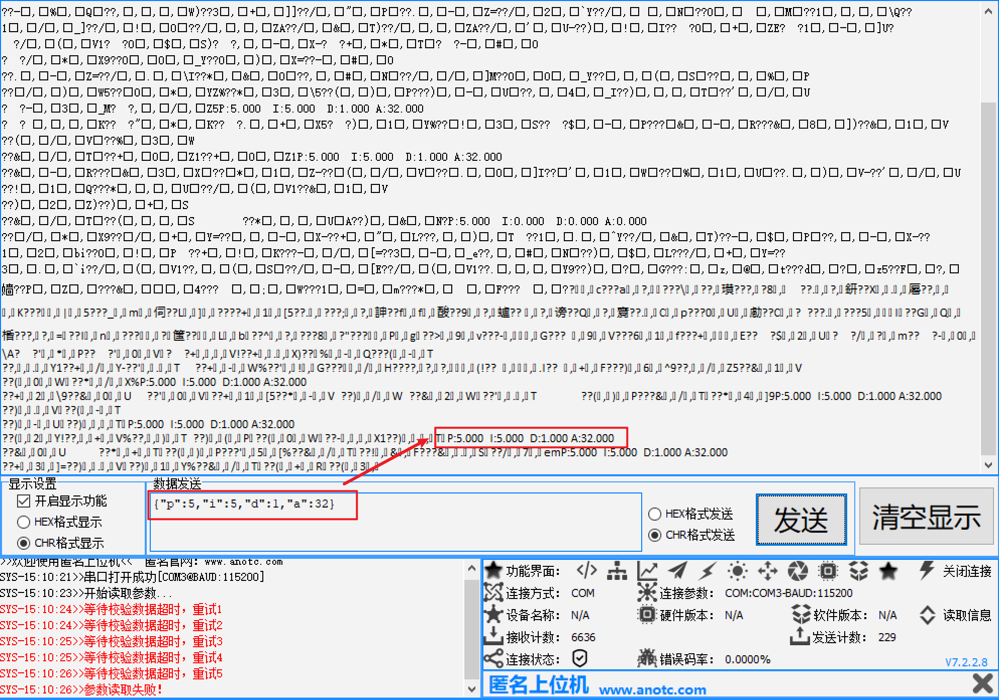

然后我们赋值改变一个电机的PID参数和目标转速

然后我们通过串口发送命令，就会改变PID的参数了


# 第九章-PID整定方法

## 9.1-调整合适的采样周期和PID调参方法

正如之前所说，现在我们PID控制函数是在主函数中循环调用，这样的调用方式并不能保证实时性，不能保证周期得到调用

所以我们要把PID控制函数放到中断里面定时执行，那么如何放到中断里面执行，执行的周期是多少合适那？

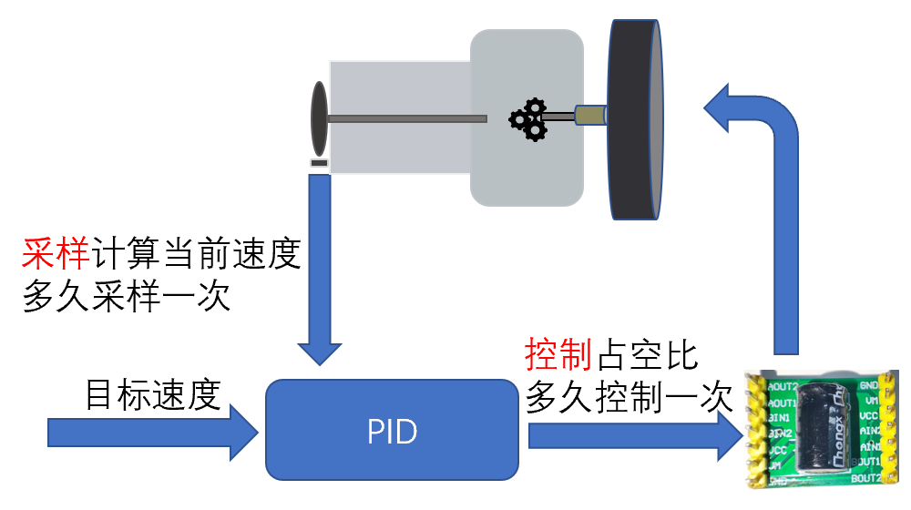


```C
		if(TimerCount %10 ==0)//每20ms一次
		{
			Motor_Set(PID_realize(&pidMotor1Speed,Motor1Speed),0);
		    TimerCount=0;
		}
	}
```

烧录测试一下，是否可以改变波形和调整参数


**借助上位机调节PID**

1. 调节P  把I=0、D=0先给正值或负值值测试P 正负、然后根据PID函数输入和输出估算P 大小，然后I=0 D=0去测试，调节一个较大值
2. 调节I  把P等于前面的值 然后测试I给较大正值和负值 测试出I正负，然后I从小值调节，直到没有偏差存在
3. 一般系统不使用D 


然后当前系统特点 :I 对于系统更重要

下面我们调节I


给一个较小的i 发现 有一个大的超调，我们就减少p 、减小一半p

下面是减少一半p 的效果


这个效果还可以

**整理双电机速度控制**

首先我们的需要是控制两个电机，那么这两个电机的特点不同，他们的P I D 参数不同，要控制不同的目标速度，那么他们的目标值、实际值、偏差等都会不同，所以我们的PID函数就要能够根据输入参数控制电机

我们增加tPid 类型函数的定义用于控制电机


```c
tPid pid1_speed;//电机1的转速控制
tPid pid2_speed;//电机2的转速控制

//初始化PID参数
void PID_init()
{
	pid1_speed.actual_val=0.0;//初始化电机1转速PID 结构体
	pid1_speed.target_val=0.0;
	pid1_speed.err=0.0;
	pid1_speed.err_last=0.0;
	pid1_speed.err_sum=0.0;
	pid1_speed.Kp=0.0;
	pid1_speed.Ki=0.0;
	pid1_speed.Kd=0.0;
	
	pid2_speed.actual_val=0.0;//初始化电机2转速PID 结构体
	pid2_speed.target_val=0.0;
	pid2_speed.err=0.0;
	pid2_speed.err_last=0.0;
	pid2_speed.err_sum=0.0;
	pid2_speed.Kp=0.0;
	pid2_speed.Ki=0.0;
	pid2_speed.Kd=0.0;
}
```

更改一下PID函数，这里我们使用结构体作为函数地址

访问因为是地址，访问结构体变量要用->

```c
float PID_realize(tPid * pid,float actual_val)
{
	pid->actual_val = actual_val;//传递真实值
	pid->err = pid->target_val - pid->actual_val;//目标值减去实际值等于误差值
	pid->err_sum += pid->err;//误差累计求和
	//使用PID控制
	pid->actual_val = pid->Kp*pid->err + pid->Ki*pid->err_sum + pid->Kd*(pid->err - pid->err_last);
	//保存上次误差:最近一次 赋值给上次
	pid->err_last = pid->err;
	
	return pid->actual_val;
}
```

更改主函数，对PID函数的使用


然后可以分别调节电机1的参数和电机二的参数

把测试好的PID 参数分别写在PID_init里面

# 以上是入门篇

通过上面的学习与实操，大家对:PWM、电机驱动、PID闭环控制、串口通信等有了一定掌握，如果上面那个章节掌握不好，一定要多看两遍视频，多敲边代码，还有疑惑可以百度查找或者留言问题。

后面的内容就是偏应用比较简单了。

# 下面应用篇

# 第10章-小车跑一跑

## 如何实现小车的前、后、左、右、停

控制电机速度就可以控制小车运动

如何控制电机速度？

改变小车速度PID的目标值，然后定时器里面的PID控制函数就会计算输占空比然后控制小车。

代码如下:

定时器里面有电机控制，我们这里还增加Motor_Set(PID_realize(&pidMotor1Speed,Motor1Speed),PID_realize(&pidMotor2Speed,Motor2Speed));

是为了提高实时性。


```C
/*******************
*  @brief  通过PID控制电机转速
*  @param  Motor1Speed:电机1 目标速度、Motor2Speed:电机2 目标速度
*  @return  无
*
*******************/
void motorPidSetSpeed(float Motor1SetSpeed,float Motor2SetSpeed)
{
	//改变电机PID参数的目标速度
	pidMotor1Speed.target_val = Motor1SetSpeed;
	pidMotor2Speed.target_val = Motor2SetSpeed;
	//根据PID计算 输出作用于电机
	Motor_Set(PID_realize(&pidMotor1Speed,Motor1Speed),PID_realize(&pidMotor2Speed,Motor2Speed));
}
```

很容易得到一下控制方式

```c
//	motorPidSetSpeed(1,2);//向右转弯
//	motorPidSetSpeed(2,1);//向左转弯
//	motorPidSetSpeed(1,1);//前进
//	motorPidSetSpeed(-1,-1);//后退
//	motorPidSetSpeed(0,0);//停止
```

## 向左原地转弯、向原地转弯


```C
//	motorPidSetSpeed(-1,1);//右原地旋转
//	motorPidSetSpeed(1,-1);//左原地旋转
```

## 加速减速函数

```c
//向前加速函数
void motorSpeedUp(void)
{
	static float MotorSetSpeedUp=0.5;//静态变量 函数结束 变量不会销毁
	if(MotorSetSpeedUp <= MAX_SPEED_UP) MotorSetSpeedUp +=0.5 ;  //如果没有超过最大值就增加0.5
	motorPidSetSpeed(MotorSetSpeedUp,MotorSetSpeedUp);//设置到电机
}
//向前减速函数
void motorSpeedCut(void)
{
	static float  MotorSetSpeedCut=3;//静态变量 函数结束 变量不会销毁
	if(MotorSetSpeedCut >=0.5) MotorSetSpeedCut-=0.5;//判断是否速度太小
	motorPidSetSpeed(MotorSetSpeedCut,MotorSetSpeedCut);//设置到电机
}

```

# 第11章-OLED速度与历程显示

这节我们显示两轮速度和里程

两轮速度很简单 之前已经计算过，那么如何计算里程那？

里程:小车行驶的路程长度。

这里我们只要计算出每个单位时间小车行驶的长度然后一直相加，就是这一段时间行驶的总里程长度了。

我们20ms计算一次,20ms走过了多少距离，然后一直相加，就是走的总距离，就是里程。这里我们使用使用电机1 车轮1进行计算。你也可以电机1 和电机2相加然后除2。


```c
		   /*里程数(cm) += 时间周期（s）*车轮转速(转/s)*车轮周长(cm)*/
		   Mileage += 0.02*Motor1Speed*22;
```

然后主函数我们通过OLED显示电机速度和小车里程


```c
    sprintf((char *)OledString,"V1:%.2fV2:%.2f", Motor1Speed,Motor2Speed);//显示两个电机的速度
	OLED_ShowString(0,0,OledString,12);//这个是oled驱动里面的，是显示位置的一个函数
	
	sprintf((char *)OledString,"Mileage:%.2f   ",Mileage);//显示里程数
	OLED_ShowString(0,1,OledString,12);//这个是oled驱动里面的，是显示位置的一个函数
```

# 第12章-ADC采集电压和显示

**什么是ADC**

百度百科介绍：


我们知道万用表 电压表可以测量电池，或者电路电压。那么我们是否可以通过单片机获得电压，方便我 们监控电池状态

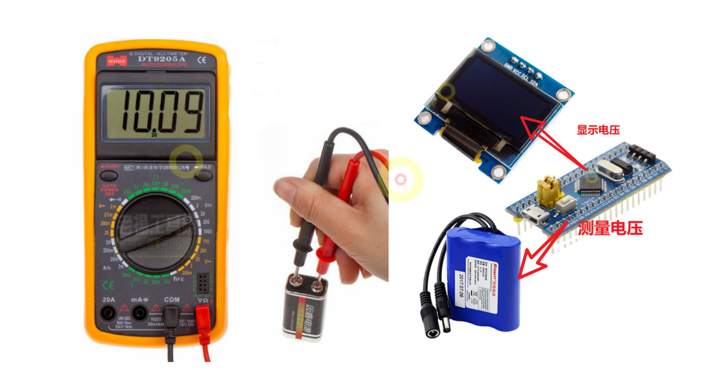

如何测量我们的锂电池电压那？锂电池电压12V左右，单片机ADC最大测量电压3.3V，这里我们需要分 压电路分压。


然后我们通过电阻分压，显而易见 ADC点的电压是VBAT_IN的 五分之一

1. 软件初始化一下ADC 。
2. 然后注意调长一点采样时间、这样精度才会更高一点。


在adc.c文件添加ADC相关函数


```c
/*******************
*  @brief  电池电压测量计算函数
*  @param  无
*  @return 小车电池电压
*
*******************/
float adcGetBatteryVoltage(void)
{
	HAL_ADC_Start(&hadc2);//启动ADC转化
	if(HAL_OK == HAL_ADC_PollForConversion(&hadc2,50))//等待转化完成、超时时间50ms
		return (float)HAL_ADC_GetValue(&hadc2)/4096*3.3*5;//计算电池电压
	return -1;
}
```

在main中调用显示函数显示电压


```c
	sprintf((char*)OledString, "U:%.2fV", adcGetBatteryVoltage());
	OLED_ShowString(0,2,OledString,12);//这个是oled驱动里面的，是显示位置的一个函数，
```


# 第13章-循迹功能

## 13.1-非PID循迹功能完成

### 先红外对管调试

我们这里学习一下，如何实现循迹功能

如何才能让小车沿着黑线运动、要让小车感知到黑线的位置，使用这种传感器就可以反馈黑线是否存在

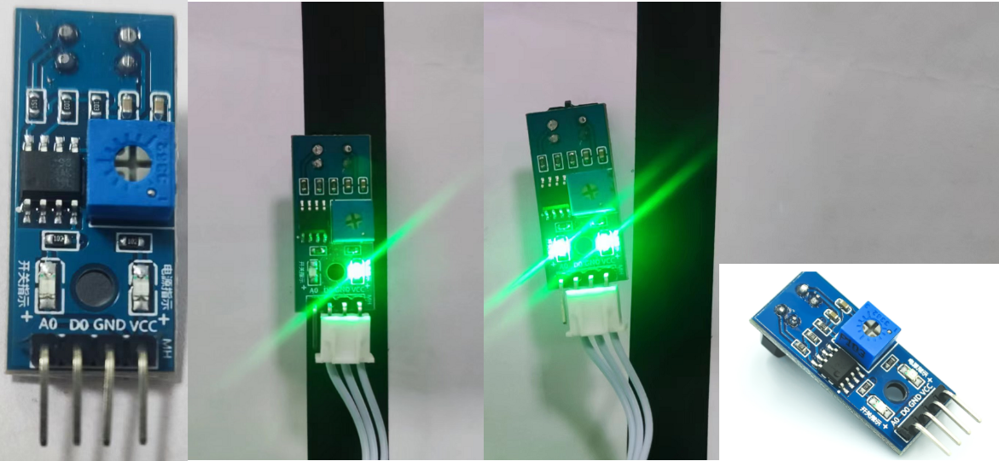

根据传感器特性，我们检测红外对管DO引脚的电压就可以知道，下面有没有黑线

**DO 高电平->有黑线 小灯灭**

**DO低电平->没有黑线 小灯亮**

这是好多地方对这个产品的说明

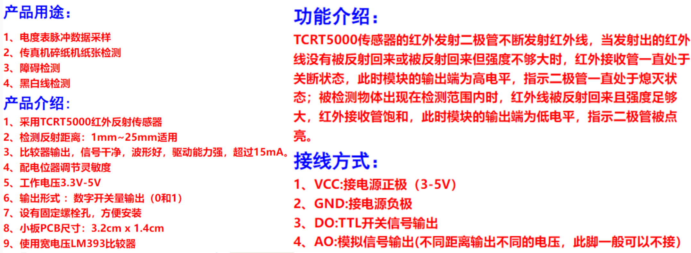

然后我们组合上面的红外对管，安装到小车上，就可以知道小车是否偏离了黑线，


下面我们通过单片机读取红外对管DO口的电压，就知道黑线在小车下面的位置了

 **STM32初始化**

先看原理图需要初始化那些引脚

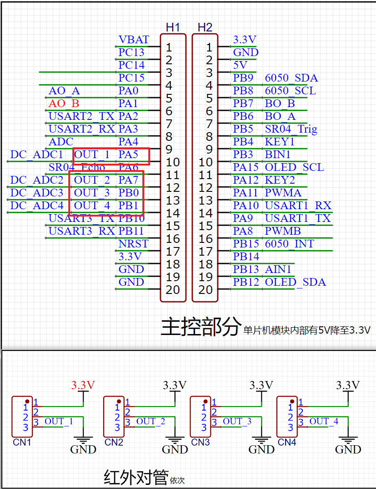

把**OUT_1-PA5、OUT_2-PA7、OUT_3-PB0、OUT_4-PB1**初始化为输入模式


重新生成

然后我们在gpio.h 添加读取GPIO的宏，使得程序更简洁


```c
#define READ_HW_OUT_1   HAL_GPIO_ReadPin(HW_OUT_1_GPIO_Port,HW_OUT_1_Pin) //读取红外对管连接的GPIO电平
#define READ_HW_OUT_2   HAL_GPIO_ReadPin(HW_OUT_2_GPIO_Port,HW_OUT_2_Pin)
#define READ_HW_OUT_3   HAL_GPIO_ReadPin(HW_OUT_3_GPIO_Port,HW_OUT_3_Pin)
#define READ_HW_OUT_4   HAL_GPIO_ReadPin(HW_OUT_4_GPIO_Port,HW_OUT_4_Pin)
```

根据红外对管状态控制电机速度

注意：整个主函数不要加入延时，这样实时性更高，可以根据红外对管状态做出及时控制


```c
	if(READ_HW_OUT_1 == 0&&READ_HW_OUT_2 == 0&&READ_HW_OUT_3 == 0&&READ_HW_OUT_4 == 0 )
	{
		printf("应该前进\r\n");
		motorPidSetSpeed(1,1);//前运动
	}
	if(READ_HW_OUT_1 == 0&&READ_HW_OUT_2 == 1&&READ_HW_OUT_3 == 0&&READ_HW_OUT_4 == 0 )
	{
		printf("应该右转\r\n");
		motorPidSetSpeed(0.5,2);//右边运动
	}
	if(READ_HW_OUT_1 == 1&&READ_HW_OUT_2 == 0&&READ_HW_OUT_3 == 0&&READ_HW_OUT_4 == 0 )
	{
		printf("快速右转\r\n");
		motorPidSetSpeed(0.5,2.5);//快速右转
	}
	if(READ_HW_OUT_1 == 0&&READ_HW_OUT_2 == 0&&READ_HW_OUT_3 == 1&&READ_HW_OUT_4 == 0 )
	{
		printf("应该左转\r\n");
		motorPidSetSpeed(2,0.5);//左边运动
	}
	if(READ_HW_OUT_1 == 0&&READ_HW_OUT_2 == 0&&READ_HW_OUT_3 == 0&&READ_HW_OUT_4 == 1 )
	{
		printf("快速左转\r\n");
		motorPidSetSpeed(2.5,0.5);//快速左转
	}
```

然后测试

1. 测试红外对管灵敏度，放在有黑线的地上或者纸上，然后把小车黑线比如放到最右边 及第一个红外对管，观察红外对管小灯变化情况和串口输出情况，如果小灯没有灭，就调节红外对管灵敏度和室内灯光，直到每个红外对管都可以感应到小灯。
2. 然后在黑线上让小车循迹


### 然后循迹功能完成

然后放到地上


## 13.2-加入循迹PID

前面的代码我们对循迹是判断的几个状态，然后PID控制电机不同速度，但是我们可以使用红外对管状态作为PID控制的输入然后再控制电机。

PID的输入是红外对管状态，我们设计 PID输入是红外对管的状态、然后输出一个速度值，然后左右电机去加或者减这个值，就可以完成根据红外对管输入对电机的差速控制

主函数添加的


```C
extern tPid pidHW_Tracking;//红外循迹的PID
uint8_t g_ucaHW_Read[4] = {0};//保存红外对管电平的数组
int8_t g_cThisState = 0;//这次状态
int8_t g_cLastState = 0; //上次状态
float g_fHW_PID_Out;//红外对管PID计算输出速度
float g_fHW_PID_Out1;//电机1的最后循迹PID控制速度
float g_fHW_PID_Out2;//电机2的最后循迹PID控制速度
```

然后实现PID循迹控制、注意为了更加快，要减少没有必要的程序和优化判断、将没有必要的输出都注释掉


```c
	g_ucaHW_Read[0] = READ_HW_OUT_1;//读取红外对管状态、这样相比于写在if里面更高效
	g_ucaHW_Read[1] = READ_HW_OUT_2;
	g_ucaHW_Read[2] = READ_HW_OUT_3;
	g_ucaHW_Read[3] = READ_HW_OUT_4;

	if(g_ucaHW_Read[0] == 0&&g_ucaHW_Read[1] == 0&&g_ucaHW_Read[2] == 0&&g_ucaHW_Read[3] == 0 )
	{
//		printf("应该前进\r\n");//注释掉更加高效，减少无必要程序执行
		g_cThisState = 0;//前进
	}
	else if(g_ucaHW_Read[0] == 0&&g_ucaHW_Read[1] == 1&&g_ucaHW_Read[2] == 0&&g_ucaHW_Read[3] == 0 )//使用else if更加合理高效
	{
//		printf("应该右转\r\n");
		g_cThisState = -1;//应该右转
	}
	else if(g_ucaHW_Read[0] == 1&&g_ucaHW_Read[1] == 0&&g_ucaHW_Read[2] == 0&&g_ucaHW_Read[3] == 0 )
	{
//		printf("快速右转\r\n");
		g_cThisState = -2;//快速右转
	}
	else if(g_ucaHW_Read[0] == 1&&g_ucaHW_Read[1] == 1&&g_ucaHW_Read[2] == 0&&g_ucaHW_Read[3] == 0)
	{
//		printf("快速右转\r\n");
		g_cThisState = -3;//快速右转
	}
	else if(g_ucaHW_Read[0] == 0&&g_ucaHW_Read[1] == 0&&g_ucaHW_Read[2] == 1&&g_ucaHW_Read[3] == 0 )
	{
//		printf("应该左转\r\n");
		g_cThisState = 1;//应该左转	
	}
	else if(g_ucaHW_Read[0] == 0&&g_ucaHW_Read[1] == 0&&g_ucaHW_Read[2] == 0&&g_ucaHW_Read[3] == 1 )
	{
//		printf("快速左转\r\n");
		g_cThisState = 2;//快速左转
	}
	else if(g_ucaHW_Read[0] == 0&&g_ucaHW_Read[1] == 0&&g_ucaHW_Read[2] == 1&&g_ucaHW_Read[3] == 1)
	{
//	    printf("快速左转\r\n");
		g_cThisState = 3;//快速左转
	}
	g_fHW_PID_Out = PID_realize(&pidHW_Tracking,g_cThisState);//PID计算输出目标速度 这个速度，会和基础速度加减

	g_fHW_PID_Out1 = 3 + g_fHW_PID_Out;//电机1速度=基础速度+循迹PID输出速度
	g_fHW_PID_Out2 = 3 - g_fHW_PID_Out;//电机1速度=基础速度-循迹PID输出速度
	if(g_fHW_PID_Out1 >5) g_fHW_PID_Out1 =5;//进行限幅 限幅速度在0-5之间
	if(g_fHW_PID_Out1 <0) g_fHW_PID_Out1 =0;
	if(g_fHW_PID_Out2 >5) g_fHW_PID_Out2 =5;
	if(g_fHW_PID_Out2 <0) g_fHW_PID_Out2 =0;
	if(g_cThisState != g_cLastState)//如何这次状态不等于上次状态、就进行改变目标速度和控制电机、在定时器中依旧定时控制电机
	{
		motorPidSetSpeed(g_fHW_PID_Out1,g_fHW_PID_Out2);//通过计算的速度控制电机
	}
	
	g_cLastState = g_cThisState;//保存上次红外对管状态
```

在pid.中


```c
tPid pidHW_Tracking;//红外循迹的PID
```


```c
	pidHW_Tracking.actual_val=0.0;
	pidHW_Tracking.target_val=0.00;//红外循迹PID 的目标值为0
	pidHW_Tracking.err=0.0;
	pidHW_Tracking.err_last=0.0;
	pidHW_Tracking.err_sum=0.0;
	pidHW_Tracking.Kp=-1.50;
	pidHW_Tracking.Ki=0;
	pidHW_Tracking.Kd=0.80;
```

然后就可以跑一下试试了。

可以改进的地方

2. 红外对管影响差速转向，也影响基础直行的速度 ，会有更好控制效果，所以可以加入每种红外对管状态下对基础速度的影响。
3. 红外对管的数量越多，效果会越好。

# 第14章-手机遥控功能

我们要实现蓝牙遥控功能，蓝牙遥控功能要使用:1.单片机的串口、2.蓝牙通信模块

所以我们先调试好:单片机的串口->蓝牙模块->接到一起联调


## 14.1-电脑控制小车

完成功能:电脑连接单片机串口三 控制小车前进后退

**先看原理图**

通过原理图可以看出这是使用的串口3 在使用的时候注意把跳线帽，跳线到蓝牙通信位置


打开初始化软件


生成代码

在main 定义全局变量

```c
uint8_t g_ucUsart3ReceiveData;  //保存串口三接收的数据
```

开启串口三中断接收


```c
  HAL_UART_Receive_IT(&huart3,&g_ucUsart3ReceiveData,1);  //串口三接收数据
```

在**usart.c** 重新实现串口中断回调函数


然后我们可以在中断回调函数里面中编写遥控命令控制逻辑了


```c
//串口接收回调函数
void HAL_UART_RxCpltCallback(UART_HandleTypeDef *huart)
{
	if( huart == &huart3)//判断中断源
	{
		if(g_ucUsart3ReceiveData == 'A') motorPidSetSpeed(1,1);//前运动
		if(g_ucUsart3ReceiveData == 'B') motorPidSetSpeed(-1,-1);//后运动
		if(g_ucUsart3ReceiveData == 'C') motorPidSetSpeed(0,0);//停止
		if(g_ucUsart3ReceiveData == 'D') motorPidSetSpeed(1,2);//右边运动	
		if(g_ucUsart3ReceiveData == 'E') motorPidSetSpeed(2,1);//左边运动
		if(g_ucUsart3ReceiveData == 'F') motorPidSpeedUp();//加速
		if(g_ucUsart3ReceiveData == 'G') motorPidSpeedCut();//减速
		
		HAL_UART_Receive_IT( &huart3, &g_ucUsart3ReceiveData, 1);//继续进行中断接收
	}
}

```

在usart.c中声明外部变量

```c
extern uint8_t g_ucUsart3ReceiveData;  //保存串口三接收的数据
```

然后我们更改一下 主函数内容，把PID红外循迹代码注释掉，然后我们增加串口三的输出，以便我们后面观察数据。

**串口不定长输出**

我们把转速等信息都可以显示在OLED上，那么如何通过串口输出那？


```c
	sprintf((char *)Usart3String,"V1:%.2fV2:%.2f\r\n",Motor1Speed,Motor2Speed);//显示两个电机转速 单位：转/秒
	HAL_UART_Transmit(&huart3,( uint8_t *)Usart3String,strlen(( const  char  *)Usart3String),50);//阻塞式发送通过串口三输出字符 strlen:计算字符串大小
	
	sprintf((char *)Usart3String,"Mileage%.2f\r\n",Mileage);//计算小车里程 单位cm
	HAL_UART_Transmit(&huart3,( uint8_t *)Usart3String,strlen(( const  char  *)Usart3String),50);//阻塞式发送通过串口三输出字符 strlen:计算字符串大小
	
	sprintf((char *)Usart3String,"U:%.2fV\r\n",adcGetBatteryVoltage());//显示电池电压
	HAL_UART_Transmit(&huart3,( uint8_t *)Usart3String,strlen(( const  char  *)Usart3String),50);//阻塞式发送通过串口三输出字符 strlen:计算字符串大小	
	HAL_Delay(5);
```

把之前PID初始化时候速度PID目标值改成0


**然后我们测试**

**硬件连接**

我们现在使用USB-TTL连接串口三，单片机串口三与电脑通信(**底板不需要插入蓝牙**)


 然后打开软件

发送指令小车就会对应运动

在电脑串口软件查看输出信息、发送 指令控制小车运动


## 14.2-手机蓝牙控制小车

功能:蓝牙遥控小车前进、后退、停止、左右转、加速、减速、手机显示数据

### 蓝牙模块和电脑通信

**蓝牙模块-硬件介绍**

使用：HC-05 主从机一体蓝牙串口透传模块 

注意： 供电3.6V-6V(最好5V)

引脚顺序 VCC GND TXD RXD


**先调试蓝牙模块-设置波特率**

如图先把蓝牙模块通过USB-TTL模块相连接，然后


如果反复测试不能进入AT模式，可能是新版蓝牙模块，


1. 先连接好蓝牙模块的几根线，然后按住蓝牙模块的按键

2. 然后连接电脑，然后几秒后蓝牙小灯慢闪，说明进入AT模式

3. 然后串口助手通过38400发送设置指令:AT+UART=115200,0,0

4. 然后收到OK数据，说明设置成功。

这个是设置波特率截图


5. 然后重新拔插蓝牙模块(不用按按键)

6. 在手机系统蓝牙配对HC-50 密码1234

7. 串口助手设置波特率115200，然后打开手机APP发送任意内容测试

这个是后面通信测试截图


8. 设置按键-按照代码设置按下发送的数据


### 蓝牙模块连接单片机

把蓝牙插入到底板、跳线帽选择蓝牙通信


按下不同按钮小车会对应控制

# 第A章-定位程序异常位置

参考连接:https://blog.csdn.net/supermuscleman/article/details/103929606

程序功能多 代码较多、可能会出现一些异常，如何锁定程序异常位置非常重要

1. 进入硬件调试-点击全速运行

   

   通过LR的值确定当前堆栈使用的PSP或者MSP

   

   然后在memory中定位到堆栈地址、然后就找到LR=08000F2D、PC=08000A02

   

   **Disassembly中,查找定位代码**

   在反汇编窗口中点击右键，选中show disassembly at address 。

   输入LR地址：为发生异常后调用的下一条指令的地址，可看到发生异常的为

   

   

    输入PC地址：可以定位到发生异常的调用语句

   

然后我们通过上面的方法就找到了异常位置


# 第15章-超声波避障功能

## 15.1-超声波测距

完成超声波测距功能、测量数据显示在OLED屏幕上

**硬件介绍**

使用：HC-SR04 超声波测距模块 

注意： 绘制PCB注意四个引脚顺序 Vcc Trig Echo Gnd

 供电3.3V-5V(最好5V)

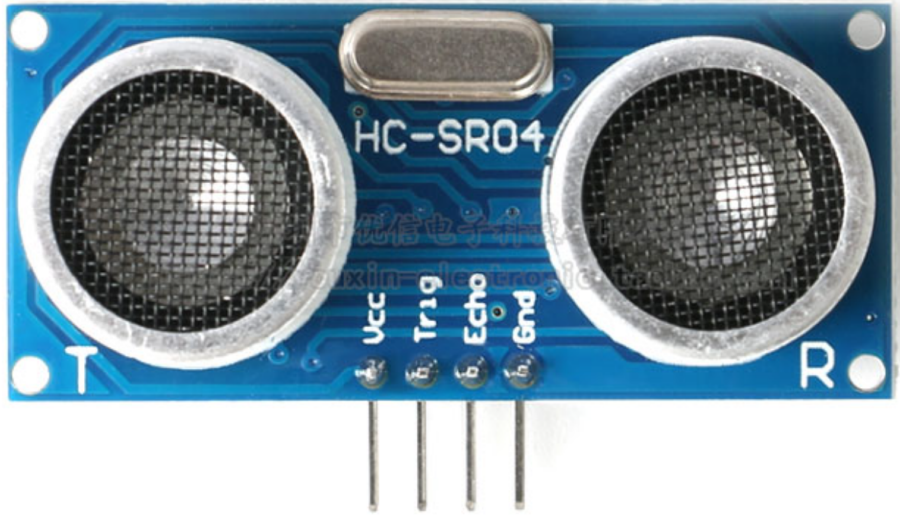

测距原理

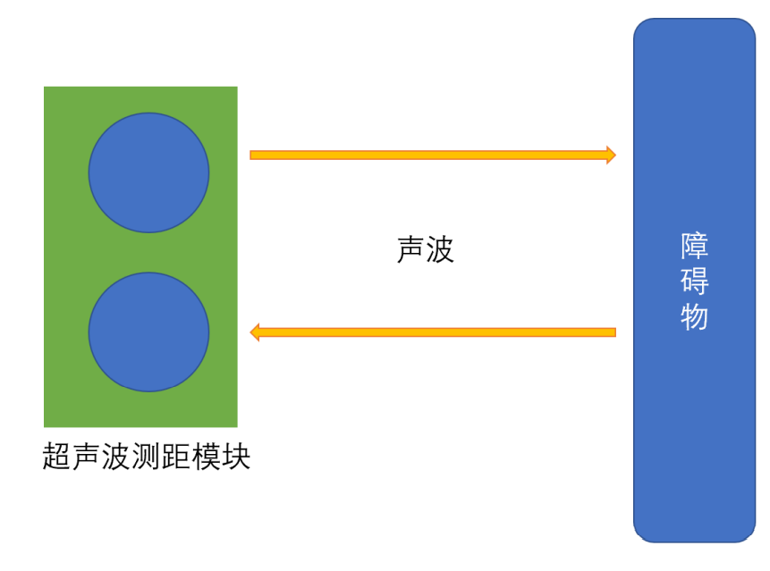

不同模式

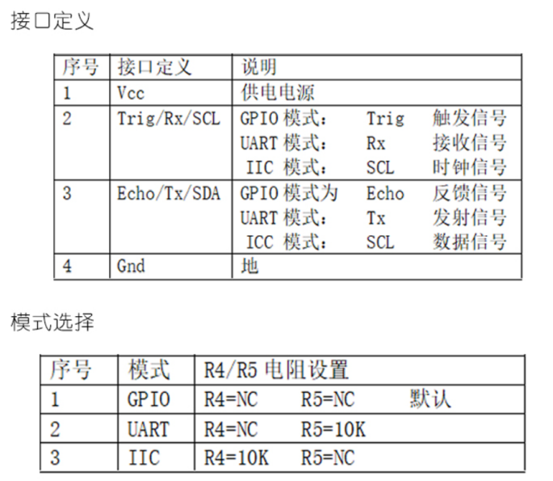

GPIO模式

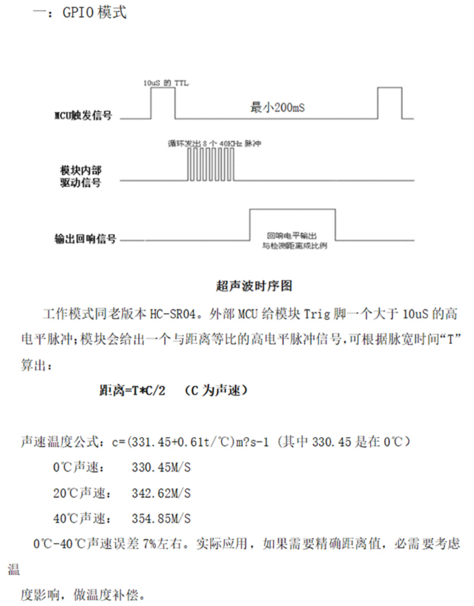


 **查看原理图**

通过超声波的硬件介绍我们知道

 MCU给Trig脚一个大于10us的高电平脉冲；然后读取Echo脚的高电平信号时间，通过公式：距离 = T* 声速/2 就可以算出来距离。

Trig(PB5)我们配置为GPIO输出

Echo(PA6)我们配置GPIO输入功能

**注：这里大家可能会问，为什么不使用定时器捕获功能？**

**原因:**

1. 留一个定时器 方便以后扩展FreeRTOS使用
2. 或者扩展其他舵机、电机等


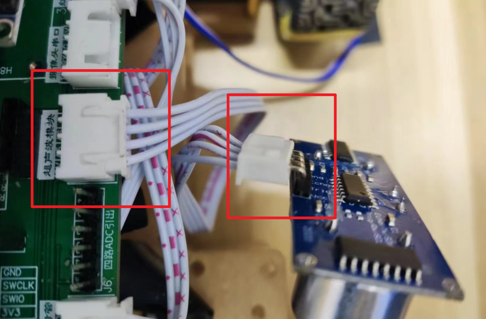

**软件初始化**

设置PB5输出模式然后起别名


设置PA6输入模式、


然后生成代码

自己新建HC_SR04.c和HC_SR04.h 然后加入工程，指定路径

防止溢出 把之前使用的数组调整大一些


因为我们不适用定时器所以我们需要自己写一个us级延时函数


```C
/*******************
*  @brief  us级延时
*  @param  usdelay:要延时的us时间
*  @return  
*
*******************/
void HC_SR04_Delayus(uint32_t usdelay)
{
  __IO uint32_t Delay = usdelay * (SystemCoreClock / 8U / 1000U/1000);//SystemCoreClock:系统频率
  do
  {
    __NOP();
  }
  while (Delay --);
}
```


```c
/*******************
*  @brief  HC_SR04读取超声波距离
*  @param  无
*  @return 障碍物距离单位:cm (静止表面平整精度更高) 
*注意:两个HC_SR04_Read()函数调用的时间间隔要2ms及以上，测量范围更大 精度更高 
*******************/
float HC_SR04_Read(void)
{
	uint32_t i = 0;
	float Distance;
	HAL_GPIO_WritePin(HC_SR04_Trig_GPIO_Port,HC_SR04_Trig_Pin,GPIO_PIN_SET);//输出15us高电平
	HC_SR04_Delayus(15);
	HAL_GPIO_WritePin(HC_SR04_Trig_GPIO_Port,HC_SR04_Trig_Pin,GPIO_PIN_RESET);//高电平输出结束，设置为低电平
	
	while(HAL_GPIO_ReadPin(HC_SR04_Echo_GPIO_Port,HC_SR04_Echo_Pin) == GPIO_PIN_RESET)//等待回响高电平
	{
		i++;
		HC_SR04_Delayus(1);
		if(i>100000) return -1;//超时退出循环、防止程序卡死这里
	}
	i = 0;
	while(HAL_GPIO_ReadPin(HC_SR04_Echo_GPIO_Port,HC_SR04_Echo_Pin) == GPIO_PIN_SET)//下面的循环是2us
	{
		i = i+1;
		HC_SR04_Delayus(1);//1us 延时，但是整个循环大概2us左右
		if(i >100000) return -2;//超时退出循环
	}
	Distance = i*2*0.033/2;//这里乘2的原因是上面是2微妙
	return Distance	;
}
```

然后就可以读距离了、连上蓝牙可以显示数据

**注意:两个HC_SR04_Read()函数调用的时间间隔要2ms及以上，测量范围更大 精度更高**


```c
	sprintf((char *)Usart3String,"HC_SR04:%.2fcm\r\n",HC_SR04_Read());//显示超声波数据
	HAL_UART_Transmit(&huart3,( uint8_t *)Usart3String,strlen(( const  char  *)Usart3String),0xFFFF);//通过串口三输出字符 strlen:计算字符串大小	

```


然后把我们的手机蓝牙和小车蓝牙连接

手机显示

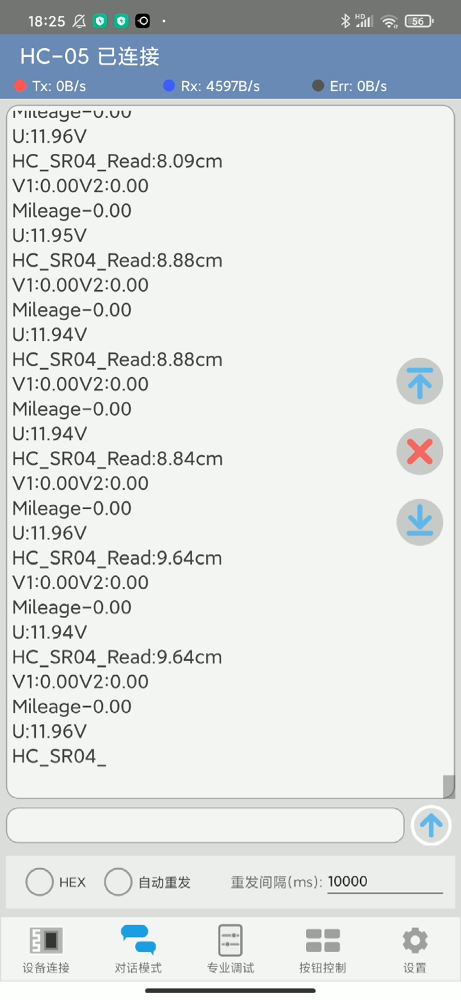

## 15.2-避障逻辑编写


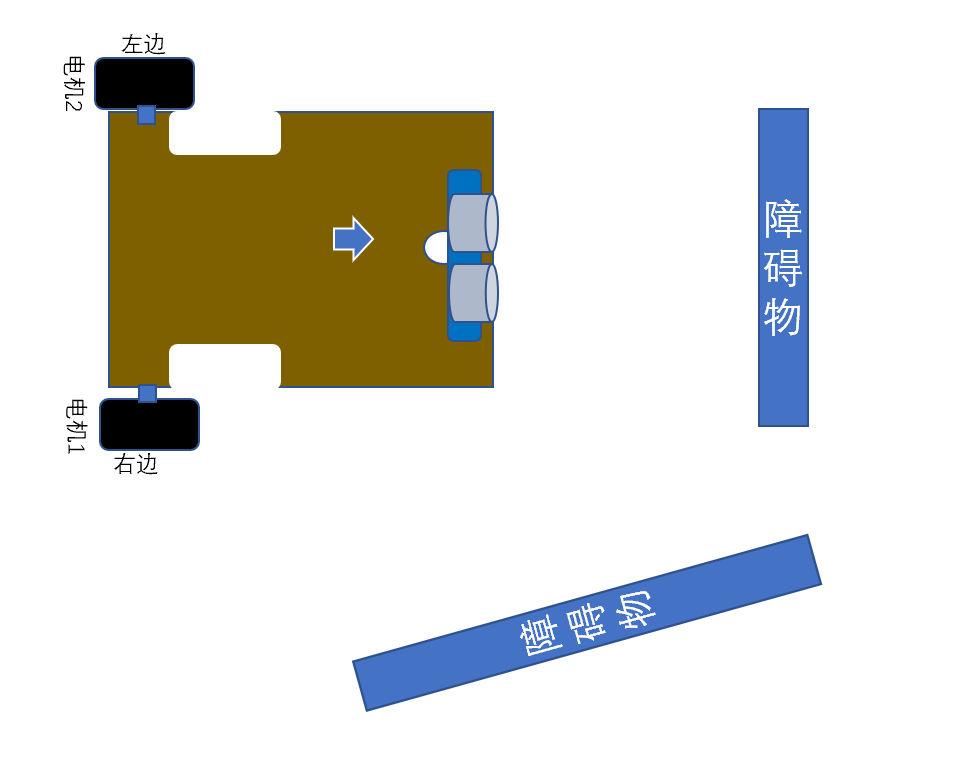


然后我们编写循迹逻辑，我们的逻辑时


```c
//**************避障功能********************//
//避障逻辑
	if(HC_SR04_Read() > 25)//前方无障碍物
	{
		motorPidSetSpeed(1,1);//前运动
		HAL_Delay(100);
	}
	else{	//前方有障碍物
		motorPidSetSpeed(-1,1);//右边运动 原地	
		HAL_Delay(500);
		if(HC_SR04_Read() > 25)//右边无障碍物
		{
			motorPidSetSpeed(1,1);//前运动
			HAL_Delay(100);
		}
		else{//右边有障碍物
			motorPidSetSpeed(1,-1);//左边运动 原地
			HAL_Delay(1000);
			if(HC_SR04_Read() >25)//左边无障碍物
			{
				 motorPidSetSpeed(1,1);//前运动
				HAL_Delay(100);
			}
			else{
				motorPidSetSpeed(-1,-1);//后运动
				HAL_Delay(1000);
				motorPidSetSpeed(-1,1);//右边运动
				HAL_Delay(50);
			}
		}
	}
```


# 第16章-超声波跟随功能

## 无PID跟随功能


```c
//超声波跟随
	if(HC_SR04_Read() > 25)
	{
		motorForward();//前进
		HAL_Delay(100);
	}
	if(HC_SR04_Read() < 20)
	{
		motorBackward();//后退
		HAL_Delay(100);
	}
```

## PID跟随功能


在pid.c中定义一组PID参数

```c
tPid pidFollow;    //定距离跟随PID
```

```c
	pidFollow.actual_val=0.0;
	pidFollow.target_val=22.50;//定距离跟随 目标距离22.5cm
	pidFollow.err=0.0;
	pidFollow.err_last=0.0;
	pidFollow.err_sum=0.0;
	pidFollow.Kp=-0.5;//定距离跟随的Kp大小通过估算PID输入输出数据，确定大概大小，然后在调试
	pidFollow.Ki=-0.001;//Ki小一些
	pidFollow.Kd=0;
```


```c
//**********PID跟随功能***********//
    g_fHC_SR04_Read=HC_SR04_Read();//读取前方障碍物距离
	if(g_fHC_SR04_Read < 60){  //如果前60cm 有东西就启动跟随
		g_fFollow_PID_Out = PID_realize(&pidFollow,g_fHC_SR04_Read);//PID计算输出目标速度 这个速度，会和基础速度加减
		if(g_fFollow_PID_Out > 6) g_fFollow_PID_Out = 6;//对输出速度限幅
		if(g_fFollow_PID_Out < -6) g_fFollow_PID_Out = -6;
		motorPidSetSpeed(g_fFollow_PID_Out,g_fFollow_PID_Out);//速度作用与电机上
	}
	else motorPidSetSpeed(0,0);//如果前面60cm 没有东西就停止
	HAL_Delay(10);//读取超声波传感器不能过快
```


然后编译，烧录测试 。


# 第17章-用6050走直线和转90度功能

## 17.1-6050姿态数据读取

### STM32读取6050数据

先把我们的参考历程里面的6050文件复制过去


添加文件


然后在魔术棒添加上面两个的路径，不再截图了。


简单阅读代码，知道 我们需要设置两个引脚，这两个引脚使用模拟IIC读取6050数据

1.在**mpuiic.c**延时使用自己写的、引脚需要使用两个先设置推挽输出、高电平


```c
void mpuiic_Delayus(uint32_t usdelay)
{
  __IO uint32_t Delay = usdelay * (SystemCoreClock /8U/1000U/1000);//SystemCoreClock:系统频率
  do
  {
    __NOP();//使用空指令延时、移植不同单片机注意__NOP(); 执行时间
  }
  while (Delay --);
}
  //MPU IIC 延时函数
void MPU_IIC_Delay(void)
{
	mpuiic_Delayus(2);
}

//初始化IIC
void MPU_IIC_Init(void)
{					     
//  GPIO_InitTypeDef  GPIO_InitStructure;
//	
//	RCC_APB2PeriphClockCmd(RCC_APB2Periph_GPIOB,ENABLE);//先使能外设IO PORTB时钟 
//		
//  GPIO_InitStructure.GPIO_Pin = GPIO_Pin_10|GPIO_Pin_11;	 // 端口配置
//  GPIO_InitStructure.GPIO_Mode = GPIO_Mode_Out_PP; 		 //推挽输出
//  GPIO_InitStructure.GPIO_Speed = GPIO_Speed_50MHz;		 //IO口速度为50MHz
//  GPIO_Init(GPIOB, &GPIO_InitStructure);					 //根据设定参数初始化GPIO 
//	
//  GPIO_SetBits(GPIOB,GPIO_Pin_10|GPIO_Pin_11);						 //PB10,PB11 输出高	
 
}
```


使用软件初始化两个引脚

**6050_SDA--PB9**

**6050_SCL--PB8**

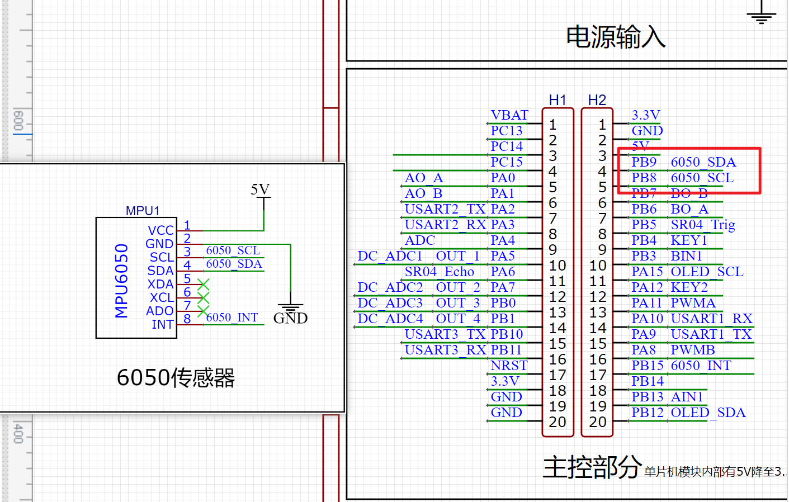

**PB8-输出模式-起始输出高电平**


**PB9 输出模式 起始状态高电平**


生成代码

**打开我们的代码，是通过模拟IIC 读取6050数据的，我们知道SDA是模拟IIC的数据线 所以通信过程中是再输入和输出模式中切换的，但是我们的STM32CubeMX是设置的输出，是在哪里更改的模式那？**

**是通过寄存器设置的，在mpuiic.h可以看到**

删除掉#include "sys.h"

把这个修改了


2.在**mpuiic.h**更改相内容

改成下面这样的


```c
//IO方向设置 设置SDA-PB9为输入或者输出
#define MPU_SDA_IN()  {GPIOB->CRH&=0XFFFFFF0F;GPIOB->CRH|=8<<4;}
#define MPU_SDA_OUT() {GPIOB->CRH&=0XFFFFFF0F;GPIOB->CRH|=3<<4;}
```

1. 这是通过**按位与后赋值 &=** 和 **按位或后赋值 |=** 

2. 设置**端口配置高寄存器**指定位。

先看一个例子


更改设置SDA与SCL电平的宏


```c
//IO操作函数	 
#define MPU_IIC_SCL_Hige    	HAL_GPIO_WritePin(SCL_6050_GPIO_Port,SCL_6050_Pin,GPIO_PIN_SET)//设置SCL高电平
#define MPU_IIC_SCL_Low      	HAL_GPIO_WritePin(SCL_6050_GPIO_Port,SCL_6050_Pin,GPIO_PIN_RESET)//设置SCL低电平
#define MPU_IIC_SDA_Hige        HAL_GPIO_WritePin(SDA_6050_GPIO_Port,SDA_6050_Pin,GPIO_PIN_SET)   //设置SDA高电平
#define MPU_IIC_SDA_Low         HAL_GPIO_WritePin(SDA_6050_GPIO_Port,SDA_6050_Pin,GPIO_PIN_RESET) //设置SDA低电平
  	 
#define MPU_READ_SDA            HAL_GPIO_ReadPin(SDA_6050_GPIO_Port,SDA_6050_Pin)    //读SDA电平
```

**更改一下 mupiic.c文件**  

把

```c
//把之前的MPU_IIC_SDA=1;	 换成 MPU_IIC_SDA_Hige;
//MPU_IIC_SDA=0;	 换成 MPU_IIC_SDA_Low;
//MPU_IIC_SCL=1;  换成 MPU_IIC_SCL_Hige;
//MPU_IIC_SCL=0;  换成 MPU_IIC_SCL_Low;
//
```

编译一下、删掉没有用的文件

把u8 替换为uint8_t


t替换一下，u8 替换为uint8_t  u32替换为uint32_t 

可以一个文件一个文件的替换掉，如果整个工程替换其他HAL库文件内容也可能改变了


删除多余的库文件

注释掉


**如果有其他的delay_ms 都替换为HAL_Delay**

还有一个错误

```c
		if((txd&0x80)>>7) MPU_IIC_SDA_Hige;
		else MPU_IIC_SDA_Low;
```


编译一下 、没有错误和警告

然后在main.c中定义变量和添加同文件

```c
float pitch,roll,yaw; // 俯仰角 横滚角 航向角

#include "mpu6050.h"
#include "inv_mpu.h"
#include "inv_mpu_dmp_motion_driver.h" 
```


替换inv_mpu.h的

```从
#include "stm32f1xx_it.h"
```


初始化6050

```C
  HAL_Delay(500);//延时0.5秒 6050上电稳定后初始化
  MPU_Init(); //初始化MPU6050
  while(MPU_Init()!=0);
  while(mpu_dmp_init()!=0);
```


我们通过下面的代码获得数据

```c
   	sprintf((char *)Usart3String,"pitch:%.2f roll:%.2f yaw:%.2f\r\n",pitch,roll,yaw);//显示6050数据
	HAL_UART_Transmit(&huart3,( uint8_t *)Usart3String,strlen(( const  char  *)Usart3String),0xFFFF);//通过串口三输出字符 strlen:计算字符串大小	
   
   //mpu_dmp_get_data(&pitch,&roll,&yaw);//返回值:0,DMP成功解出欧拉角
    while(mpu_dmp_get_data(&pitch,&roll,&yaw)!=0){}  //这个可以解决经常读不出数据的问题
```


然后我看一下 这个Usart3String 现在发送的大概多大的？


```c
uint8_t OledString[50];
uint8_t Usart3String[50];
```

编译、烧录、然后就可以连接手机蓝牙，在蓝牙软件查看数据了

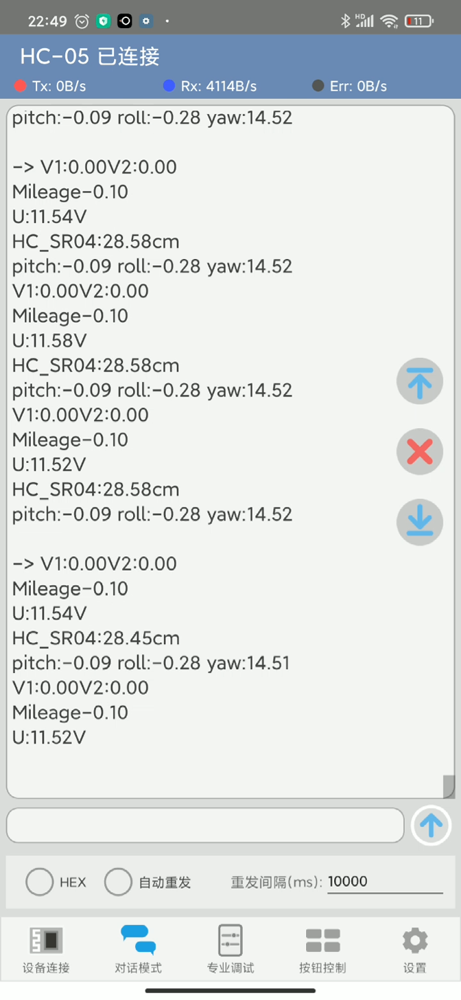


## 17.2-利用6050直线和90度(有代码)

**为什么小车还是不能走直线**

为什么两个电机转速一样不能走非常正直线，如何控制小车转弯90度。

当然，我们可以开环控制，但是控制效果可能不好，受外界影响比较大。

如果我们使用闭环控制，就要使用一个传感器来获得现在小车角度。


https://www.bilibili.com/video/BV1UV4y1p7Hd/?spm_id_from=333.337.search-card.all.click

### 走直线(控制朝一个方向运动)


在pid.c中定义一个姿态控制使用的PID


```c
tPid pidMPU6050YawMovement;  //利用6050偏航角 进行姿态控制的PID
```


```c
	pidMPU6050YawMovement.actual_val=0.0;
	pidMPU6050YawMovement.target_val=0.00;//设定姿态目标值
	pidMPU6050YawMovement.err=0.0;
	pidMPU6050YawMovement.err_last=0.0;
	pidMPU6050YawMovement.err_sum=0.0;
	pidMPU6050YawMovement.Kp=2;//定距离跟随的Kp大小通过估算PID输入输出数据，确定大概大小，然后在调试
	pidMPU6050YawMovement.Ki=0;
	pidMPU6050YawMovement.Kd=0;
```

仿照之前红外循迹代码编写姿态控制函数


```c
float  g_fMPU6050YawMovePidOut = 0.00f; //姿态PID运算输出
float  g_fMPU6050YawMovePidOut1 = 0.00f; //第一个电机控制输出
float  g_fMPU6050YawMovePidOut2 = 0.00f; //第一个电机控制输出
```

走直线程序如下(因为上电初始化时候航向角是0、而且pidMPU6050YawMovementPID结构体的目标值target_val 也是0)


```c
//*************MPU6050航向角 PID转向控制*****************//

   	sprintf((char *)Usart3String,"pitch:%.2f roll:%.2f yaw:%.2f\r\n",pitch,roll,yaw);//显示6050数据 俯仰角 横滚角 航向角
	HAL_UART_Transmit(&huart3,( uint8_t *)Usart3String,strlen(( const  char  *)Usart3String),0xFFFF);//通过串口三输出字符 strlen:计算字符串大小	
   
   //mpu_dmp_get_data(&pitch,&roll,&yaw);//返回值:0,DMP成功解出欧拉角
    while(mpu_dmp_get_data(&pitch,&roll,&yaw)!=0){}  //这个可以解决经常读不出数据的问题
	
	
	g_fMPU6050YawMovePidOut = PID_realize(&pidMPU6050YawMovement,yaw);//PID计算输出目标速度 这个速度，会和基础速度加减

	g_fMPU6050YawMovePidOut1 = 1.5 + g_fMPU6050YawMovePidOut;//基础速度加减PID输出速度
	g_fMPU6050YawMovePidOut2 = 1.5 - g_fMPU6050YawMovePidOut;
	if(g_fMPU6050YawMovePidOut1 >3.5) g_fMPU6050YawMovePidOut1 =3.5;//进行限幅
	if(g_fMPU6050YawMovePidOut1 <0) g_fMPU6050YawMovePidOut1 =0;
	if(g_fMPU6050YawMovePidOut2 >3.5) g_fMPU6050YawMovePidOut2 =3.5;
	if(g_fMPU6050YawMovePidOut2 <0) g_fMPU6050YawMovePidOut2 =0;
	motorPidSetSpeed(g_fMPU6050YawMovePidOut1,g_fMPU6050YawMovePidOut2);

```

然后调节PID参数

顺序 先确定P 正负 然后P大小 

然后D正负 然后D大小

最后调节的参数如下


```C
	pidMPU6050YawMovement.Kp=0.02;//6050航向角PID运动控制 
	pidMPU6050YawMovement.Ki=0;
	pidMPU6050YawMovement.Kd=0.1;
```

然后我们把小车放在地上就可以完成一直朝着初始方向前进，如果往侧面推也会马上矫正。

### 转弯90度功能(控制转弯角度)

然后我们增加一下，如何旋转90度程序

在串口接收回调函数表姿态PID的目标值


```C
extern tPid pidMPU6050YawMovement;  //利用6050偏航角 进行姿态控制的PID
```


```c
		if(g_ucUsart3ReceiveData == 'H')//转向90度
		{				
			if(pidMPU6050YawMovement.target_val <= 180)pidMPU6050YawMovement.target_val += 90;//目标值
		}
		if(g_ucUsart3ReceiveData == 'I')//转回90度
		{				
			if(pidMPU6050YawMovement.target_val >= -180)pidMPU6050YawMovement.target_val -= 90;//目标值
        }	
```

然后我们的蓝牙APP增加两个发送按钮的设置


现象 是上电小车向初始方向直行，如果推小车车头方向，小车能够立马矫正。

然后连接蓝牙发送转90度 小车会转90度，按下 转回90度小车回转回。

# 第18章-综合以上功能

## 18-按键和app按钮切换功能

根据上面介绍，我们的模式可以有：

**OLED显示模式: 速度、里程、电压、超声波数据、MPU6050俯仰角、横滚角、航向角 数据显示在OLED上和通过串口发送蓝牙APP ** 

**PID循迹模式:红外对管PID循迹**

**手机遥控普通运动模式:遥控前、后、左、右加速运动**

**超声波避障模式**

**PID跟随模式:超声波PID定距离跟随**

**手机遥控角度闭环模式：MPU6050角度PID控制**

可以设置标志位通过按键改变标志位，以实现功能切换。

定义一个全局变量，

```c
uint8_t g_ucMode = 0; 
//小车运动模式标志位 0:显示功能、1:PID循迹模式、2:手机遥控普通运动模式、3.超声波避障模式、4:PID跟随模式、5:遥控角度闭环
```


```c
uint8_t g_ucMode = 0; //小车运动模式标志位
```

在gpio.h声明一下


```c
extern uint8_t g_ucMode ; //小车运动模式标志位
```


按键中断回调函数里面补充按下按键后的处理

先不进行消抖，如果后面KEY1 KEY2效果不好再消抖


```c
void HAL_GPIO_EXTI_Callback(uint16_t GPIO_Pin)
{
	if(GPIO_Pin == KEY1_Pin) //判断一下那个引脚触发中断
	{
		//这里编写触发中断后要执行的程序
		if(g_ucMode == 5) g_ucMode = 1;//g_ucMode模式是0 1 2 3 4 5 
		else
		{
			g_ucMode+=1;
		}
		HAL_GPIO_TogglePin(LED_GPIO_Port,LED_Pin);
	}
	if(GPIO_Pin == KEY2_Pin) //判断一下那个引脚触发中断
	{
		//这里编写触发中断后要执行的程序
		g_ucMode=0;
		HAL_GPIO_TogglePin(LED_GPIO_Port,LED_Pin);
	}
}
```

然后主函数显示当前处于的模式

然后判断当前模式 执行不同代码

方法：一个功能一个功能的添加代码，添加好一个调试测试一下，然后再添加下一个

下面这个就是我们主函数的代码。

```c
	sprintf((char *)OledString," g_ucMode:%d",g_ucMode);//显示g_ucMode 当前模式
	OLED_ShowString(0,6,OledString,12);	//显示在OLED上
	
	sprintf((char *)Usart3String," g_ucMode:%d",g_ucMode);//蓝牙APP显示
	HAL_UART_Transmit(&huart3,( uint8_t *)Usart3String,strlen(( const  char  *)Usart3String),50);//阻塞式发送通过串口三输出字符 strlen:计算字符串大小
	
	if(g_ucMode == 0)
	{
	//0LED显示功能
		sprintf((char*)OledString, "V1:%.2fV2:%.2f", Motor1Speed,Motor2Speed);//显示速度
		OLED_ShowString(0,0,OledString,12);//这个是oled驱动里面的，是显示位置的一个函数，
		
		sprintf((char*)OledString, "Mileage:%.2f", Mileage);//显示里程
		OLED_ShowString(0,1,OledString,12);//这个是oled驱动里面的，是显示位置的一个函数，
		
		sprintf((char*)OledString, "U:%.2fV", adcGetBatteryVoltage());//显示电池电压
		OLED_ShowString(0,2,OledString,12);//这个是oled驱动里面的，是显示位置的一个函数，
		
		sprintf((char *)OledString,"HC_SR04:%.2fcm\r\n",HC_SR04_Read());//显示超声波数据
		OLED_ShowString(0,3,OledString,12);//这个是oled驱动里面的，是显示位置的一个函数，
		
		sprintf((char *)OledString,"p:%.2f r:%.2f \r\n",pitch,roll);//显示6050数据 俯仰角 横滚角
		OLED_ShowString(0,4,OledString,12);//这个是oled驱动里面的，是显示位置的一个函数，
		
		sprintf((char *)OledString,"y:%.2f  \r\n",yaw);//显示6050数据  航向角
		OLED_ShowString(0,5,OledString,12);//这个是oled驱动里面的，是显示位置的一个函数，
		
	//蓝牙APP显示
		sprintf((char*)Usart3String, "V1:%.2fV2:%.2f", Motor1Speed,Motor2Speed);//显示速度
		HAL_UART_Transmit(&huart3,( uint8_t *)Usart3String,strlen(( const  char  *)Usart3String),50);//阻塞式发送通过串口三输出字符 strlen:计算字符串大小
		//阻塞方式发送可以保证数据发送完毕，中断发送不一定可以保证数据已经发送完毕才启动下一次发送
		sprintf((char*)Usart3String, "Mileage:%.2f", Mileage);//显示里程
		HAL_UART_Transmit(&huart3,( uint8_t *)Usart3String,strlen(( const  char  *)Usart3String),50);//阻塞式发送通过串口三输出字符 strlen:计算字符串大小
		
		sprintf((char*)Usart3String, "U:%.2fV", adcGetBatteryVoltage());//显示电池电压
		HAL_UART_Transmit(&huart3,( uint8_t *)Usart3String,strlen(( const  char  *)Usart3String),50);//阻塞式发送通过串口三输出字符 strlen:计算字符串大小
		
		sprintf((char *)Usart3String,"HC_SR04:%.2fcm\r\n",HC_SR04_Read());//显示超声波数据
		HAL_UART_Transmit(&huart3,( uint8_t *)Usart3String,strlen(( const  char  *)Usart3String),50);//阻塞式发送通过串口三输出字符 strlen:计算字符串大小
		
		sprintf((char *)Usart3String,"p:%.2f r:%.2f \r\n",pitch,roll);//显示6050数据 俯仰角 横滚角
		HAL_UART_Transmit(&huart3,( uint8_t *)Usart3String,strlen(( const  char  *)Usart3String),50);//阻塞式发送通过串口三输出字符 strlen:计算字符串大小
		
		sprintf((char *)Usart3String,"y:%.2f  \r\n",yaw);//显示6050数据  航向角
		HAL_UART_Transmit(&huart3,( uint8_t *)Usart3String,strlen(( const  char  *)Usart3String),50);//阻塞式发送通过串口三输出字符 strlen:计算字符串大小
	
		//获得6050数据
		while(mpu_dmp_get_data(&pitch,&roll,&yaw)!=0){}  //这个可以解决经常读不出数据的问题
		
		//显示模式电机停转
		motorPidSetSpeed(0,0);
	}
	if(g_ucMode == 1)
	{
	///****    红外PID循迹功能******************/
	g_ucaHW_Read[0] = READ_HW_OUT_1;//读取红外对管状态、这样相比于写在if里面更高效
	g_ucaHW_Read[1] = READ_HW_OUT_2;
	g_ucaHW_Read[2] = READ_HW_OUT_3;
	g_ucaHW_Read[3] = READ_HW_OUT_4;

	if(g_ucaHW_Read[0] == 0&&g_ucaHW_Read[1] == 0&&g_ucaHW_Read[2] == 0&&g_ucaHW_Read[3] == 0 )
	{
//		printf("应该前进\r\n");//注释掉更加高效，减少无必要程序执行
		g_cThisState = 0;//前进
	}
	else if(g_ucaHW_Read[0] == 0&&g_ucaHW_Read[1] == 1&&g_ucaHW_Read[2] == 0&&g_ucaHW_Read[3] == 0 )//使用else if更加合理高效
	{
//		printf("应该右转\r\n");
		g_cThisState = -1;//应该右转
	}
	else if(g_ucaHW_Read[0] == 1&&g_ucaHW_Read[1] == 0&&g_ucaHW_Read[2] == 0&&g_ucaHW_Read[3] == 0 )
	{
//		printf("快速右转\r\n");
		g_cThisState = -2;//快速右转
	}
	else if(g_ucaHW_Read[0] == 1&&g_ucaHW_Read[1] == 1&&g_ucaHW_Read[2] == 0&&g_ucaHW_Read[3] == 0)
	{
//		printf("快速右转\r\n");
		g_cThisState = -3;//快速右转
	}
	else if(g_ucaHW_Read[0] == 0&&g_ucaHW_Read[1] == 0&&g_ucaHW_Read[2] == 1&&g_ucaHW_Read[3] == 0 )
	{
//		printf("应该左转\r\n");
		g_cThisState = 1;//应该左转	
	}
	else if(g_ucaHW_Read[0] == 0&&g_ucaHW_Read[1] == 0&&g_ucaHW_Read[2] == 0&&g_ucaHW_Read[3] == 1 )
	{
//		printf("快速左转\r\n");
		g_cThisState = 2;//快速左转
	}
	else if(g_ucaHW_Read[0] == 0&&g_ucaHW_Read[1] == 0&&g_ucaHW_Read[2] == 1&&g_ucaHW_Read[3] == 1)
	{
//	    printf("快速左转\r\n");
		g_cThisState = 3;//快速左转
	}
	g_fHW_PID_Out = PID_realize(&pidHW_Tracking,g_cThisState);//PID计算输出目标速度 这个速度，会和基础速度加减

	g_fHW_PID_Out1 = 3 + g_fHW_PID_Out;//电机1速度=基础速度+循迹PID输出速度
	g_fHW_PID_Out2 = 3 - g_fHW_PID_Out;//电机1速度=基础速度-循迹PID输出速度
	if(g_fHW_PID_Out1 >5) g_fHW_PID_Out1 =5;//进行限幅 限幅速度在0-5之间
	if(g_fHW_PID_Out1 <0) g_fHW_PID_Out1 =0;
	if(g_fHW_PID_Out2 >5) g_fHW_PID_Out2 =5;
	if(g_fHW_PID_Out2 <0) g_fHW_PID_Out2 =0;
	if(g_cThisState != g_cLastState)//如何这次状态不等于上次状态、就进行改变目标速度和控制电机、在定时器中依旧定时控制电机
	{
		motorPidSetSpeed(g_fHW_PID_Out1,g_fHW_PID_Out2);//通过计算的速度控制电机
	}
	
	g_cLastState = g_cThisState;//保存上次红外对管状态	

	}
	if(g_ucMode == 2)
	{
		//***************遥控模式***********************//
		//遥控模式的控制在串口三的中断里面
	}
	if(g_ucMode == 3)
	{
		//******超声波避障模式*********************//
////避障逻辑
		if(HC_SR04_Read() > 25)//前方无障碍物
		{
			motorPidSetSpeed(1,1);//前运动
			HAL_Delay(100);
		}
		else{	//前方有障碍物
			motorPidSetSpeed(-1,1);//右边运动 原地	
			HAL_Delay(500);
			if(HC_SR04_Read() > 25)//右边无障碍物
			{
				motorPidSetSpeed(1,1);//前运动
				HAL_Delay(100);
			}
			else{//右边有障碍物
				motorPidSetSpeed(1,-1);//左边运动 原地
				HAL_Delay(1000);
				if(HC_SR04_Read() >25)//左边无障碍物
				{
					 motorPidSetSpeed(1,1);//前运动
					HAL_Delay(100);
				}
				else{
					motorPidSetSpeed(-1,-1);//后运动
					HAL_Delay(1000);
					motorPidSetSpeed(-1,1);//右边运动
					HAL_Delay(50);
				}
			}
		}
	}
	if(g_ucMode == 4)
	{
	//**********PID跟随功能***********//
		g_fHC_SR04_Read=HC_SR04_Read();//读取前方障碍物距离
		if(g_fHC_SR04_Read < 60){  //如果前60cm 有东西就启动跟随
			g_fFollow_PID_Out = PID_realize(&pidFollow,g_fHC_SR04_Read);//PID计算输出目标速度 这个速度，会和基础速度加减
			if(g_fFollow_PID_Out > 6) g_fFollow_PID_Out = 6;//对输出速度限幅
			if(g_fFollow_PID_Out < -6) g_fFollow_PID_Out = -6;
			motorPidSetSpeed(g_fFollow_PID_Out,g_fFollow_PID_Out);//速度作用与电机上
		}
		else motorPidSetSpeed(0,0);//如果前面60cm 没有东西就停止
		HAL_Delay(10);//读取超声波传感器不能过快
	}
	if(g_ucMode == 5)
	{
	//*************MPU6050航向角 PID转向控制*****************//

		sprintf((char *)Usart3String,"pitch:%.2f roll:%.2f yaw:%.2f\r\n",pitch,roll,yaw);//显示6050数据 俯仰角 横滚角 航向角
		HAL_UART_Transmit(&huart3,( uint8_t *)Usart3String,strlen(( const  char  *)Usart3String),0xFFFF);//通过串口三输出字符 strlen:计算字符串大小	
	   
	   //mpu_dmp_get_data(&pitch,&roll,&yaw);//返回值:0,DMP成功解出欧拉角
		while(mpu_dmp_get_data(&pitch,&roll,&yaw)!=0){}  //这个可以解决经常读不出数据的问题
		
		
		g_fMPU6050YawMovePidOut = PID_realize(&pidMPU6050YawMovement,yaw);//PID计算输出目标速度 这个速度，会和基础速度加减

		g_fMPU6050YawMovePidOut1 = 1.5 + g_fMPU6050YawMovePidOut;//基础速度加减PID输出速度
		g_fMPU6050YawMovePidOut2 = 1.5 - g_fMPU6050YawMovePidOut;
		if(g_fMPU6050YawMovePidOut1 >3.5) g_fMPU6050YawMovePidOut1 =3.5;//进行限幅
		if(g_fMPU6050YawMovePidOut1 <0) g_fMPU6050YawMovePidOut1 =0;
		if(g_fMPU6050YawMovePidOut2 >3.5) g_fMPU6050YawMovePidOut2 =3.5;
		if(g_fMPU6050YawMovePidOut2 <0) g_fMPU6050YawMovePidOut2 =0;
		motorPidSetSpeed(g_fMPU6050YawMovePidOut1,g_fMPU6050YawMovePidOut2);
	
	}
```

可以测试上面的代码 然后没有问题后，我们添加一个通过蓝牙APP按钮切换模式代码


```c
		if(g_ucUsart3ReceiveData == 'J') //改变模式
		{
			if(g_ucMode == 5) g_ucMode = 1;//g_ucMode模式是0 1 2 3 4 5 
			else
			{
				g_ucMode+=1;
			}
		}
		if(g_ucUsart3ReceiveData == 'K') g_ucMode=0;//设置为显示模式
```

然后对应APP也要添加 按钮设置

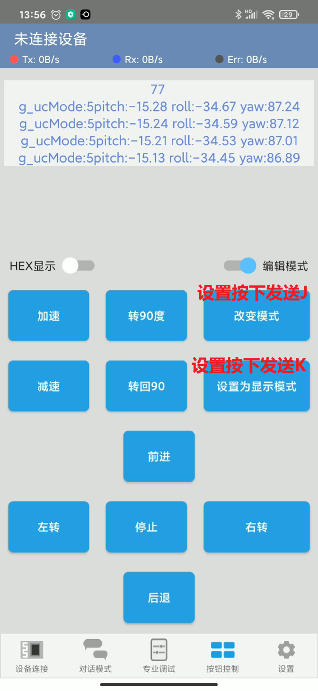

我们

按键没有消抖效果不好，我们消抖一下


我们增加了 HAL延时和再次判断电平

```c
void HAL_GPIO_EXTI_Callback(uint16_t GPIO_Pin)
{
	if(GPIO_Pin == KEY1_Pin) //判断一下那个引脚触发中断
	{
		HAL_Delay(10);//延时消抖 主要
		if(HAL_GPIO_ReadPin(KEY1_GPIO_Port, KEY1_Pin) == GPIO_PIN_SET)//判断KEY1引脚仍为高电平
		{
			//这里编写触发中断后要执行的程序
			if(g_ucMode == 5) g_ucMode = 1;//g_ucMode模式是0 1 2 3 4 5 
			else
			{
				g_ucMode+=1;
			}
			HAL_GPIO_TogglePin(LED_GPIO_Port,LED_Pin);
		}
	}
	if(GPIO_Pin == KEY2_Pin) //判断一下那个引脚触发中断
	{
		HAL_Delay(10);//延时消抖
		if(HAL_GPIO_ReadPin(KEY2_GPIO_Port, KEY2_Pin) == GPIO_PIN_RESET)//判断KEY2引脚仍为低电平
		{
			//这里编写触发中断后要执行的程序
			g_ucMode=0;
			HAL_GPIO_TogglePin(LED_GPIO_Port,LED_Pin);
		}
	}
}

```

但是测试不能执行中断，程序异常卡死了

原因是HAL_Delay使用的是sysTick 中断优先级在软件初始化是默认最低的，比外部中断优先级低，所以HAL_Delay不能在外部中断服务函数中调用。

所以我们可以通过提高sysTick 中断的优先级，提高的比HAL_Delay高。


然后我们提高至 如下图


然后编译烧录测试按键是否更加稳定。

# 以上是应用篇

# 下面19是扩展

# 第22章-小车如何查找异常问题

前面我们已经移植 好了OLED程序，下面我们就直接使用OLED,我们在定时器刷新OLED，我们50ms执行一次


应该这样写


显示行进路程累计

但是发现计算不准确，怀疑中断时间不准确，如何确定中断是否按时到达那？

1. 使用sysTick统计时间


2. 在要判断时间的地方反转GPIO通过示波器观察 是否按时中断


 然后示波器测量引脚PC13


所以调试发现


 所以更新显示应该放到主函数执行，然后 

我们的中断函数这样写


```c
	    if(EncoderTimer_Count%10 == 0)  //每20ms 进入一次
		{
		
			//进行PID计算、然后作用于电机
			Motor_Set(PID_realize(&pid1_speed,Motor1_Speed),PID_realize(&pid2_speed,Motor2_Speed));
			//向上位机发送数据
			ANO_DT_Send_F2(Motor1_Speed*100, 3.0*100,Motor2_Speed*100,3.0*100);
			
			HAL_GPIO_TogglePin(LED_GPIO_Port,LED_Pin);//切换LED GPIO状态
			/*里程数 += 时间周期（s）*车轮转速(转/s)*车轮周长(cm)*/
			Mileage += 0.02*Motor1_Speed*22;
			
			EncoderTimer_Count = 0; //清空计数值
		}
```

然后主函数刷新


```c
	sprintf((char *)string,"V1:%.2fV2:%.2f ",Motor1_Speed,Motor2_Speed);//显示两个电机转速 单位：转/秒
	OLED_ShowString(0,0,string,12);
			
	sprintf((char *)string,"Mileage%.2f  ",Mileage);//显示两个电机转速 单位：转/秒
	OLED_ShowString(0,1,string,12);
```


# 一些测试中的坑

## DAP识别芯片无法烧录

使用这个DAP无法下载这个淘宝核心板

点击下载出现这个报错

```C
Not a genuine ST Device! Abort connection
```


https://blog.csdn.net/chunquqiulailll/article/details/113257923


如果这里识别为


安装过程芯片支持包


这里就会自动切换


## DAP无法识别芯片


解决方法:

断电，将板子上的BOOT0用短路帽接入3.3V高电平，重新插入DAP，不出意外可见程序烧录成功，此时将BOOT0接回低电平，后续烧录程序便不会出现SWD/JTAG Communication Failure


### 一个DAP可以问题记录

烧录代码(烧录时候、断掉电池供电、使用DAP给单片机供电)


## stlink下载程序

下载程序出现错误

Debugger - Cortex-M ErrorCannot access target.Shutting down debug session.


取消这个勾选、然后编译


然后编译一下

然后再改回来

反复勾选、编译、取消勾选，然后编译，就可以下载了。

然后我勾选这，就可以下载了


说更新最新的支持包试试

https://www.keil.com/dd2/Pack/#!#eula-container

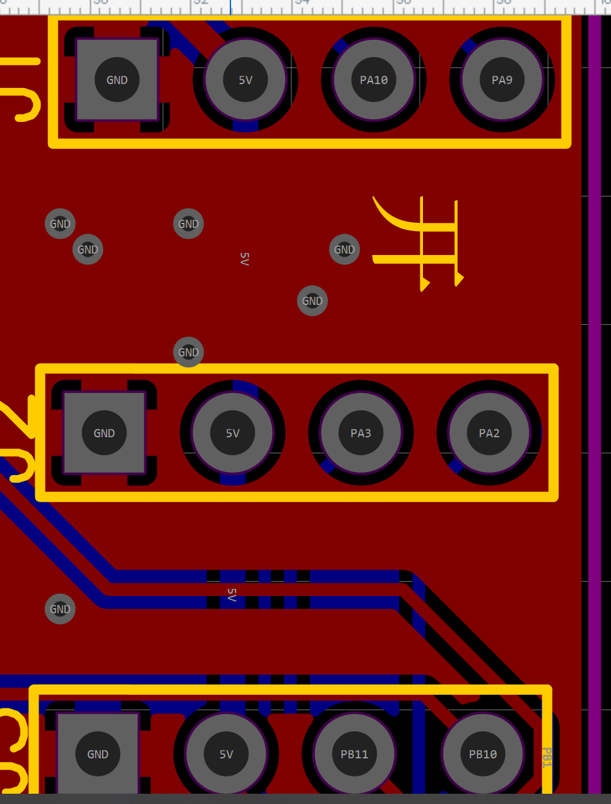

## 其他的记录

细分更多、注意那么电机占空比控制函数也要变化


